## 1. **Отличие решаемых задач в теории вероятностей и математической статистики. Основная задача статистики. Вероятность. ЗБЧ. Описание случайных величин: дискретных и непрерывных. Характеристики распределений. Квантиль.**

**Теория вероятностей (ТВ) и математическая статистика (МС) решают обратные задачи**: ТВ предсказывает свойства выборок, зная закон распределения (параметры), а МС, наоборот, по выборке определяет этот закон и его параметры (мат. ожидание, дисперсию), оценивая достоверность. **Основная задача статистики** — анализ собранных данных для изучения закономерностей массовых явлений и получения выводов, используя методы ТВ для интерпретации случайности. 

**Вероятность события** — доля испытаний, завершившихся наступлением события, в бесконечном эксперименте.
**Закон больших чисел**: на больших выборках частота события хорошо приближает его вероятность.

**Дискретная случайная величина** $X$ принимает счётное множество значений A = {a₁, a₂, …}  с вероятностями $p_1, p_2, \ldots$ и $\sum_i p_i = 1$.

$$f_X(a_i) = P(X = a_i) = p_i$$ - функция вероятности(плотности).

**Непрерывная случайная величина** задаётся с помощью функции распределения:

$$F_X(x) = P(X \leq x)$$

или плотности распределения:

$$ f_X(x) : \int_a^b f_X(x) \, dx = P(a \leq X \leq b) $$

**Характеристики распределений**:

Матожидание — среднее значение $X$:

$$ EX = \int x \, dF(x) $$

Дисперсия — мера разброса $X$:

$$\mathbb{D}X = \mathbb{E} \left( (X - EX)^2 \right)$$

Квантиль порядка $\alpha \in (0, 1)$:

$$X_\alpha : P(X \leq X_\alpha) \geq \alpha, \, P(X \geq X_\alpha) \geq 1 - \alpha$$

Эквивалентное определение:

$$X_\alpha = F^{-1} (\alpha) = \inf \{ x : F(x) \geq \alpha \}$$

Медиана — квантиль порядка 0.5, центральное значение распределения:

$$\text{med } X : P(X \leq \text{med } X) \geq 0.5, \, P(X \geq \text{med } X) \geq 0.5$$

Интерквартильный размах:

$$IQR = X_{0.75} - X_{0.25}$$

Мода — точка максимума функции вероятности или плотности:

$$\text{mode } X = \arg \max_x f(x)$$

Коэффициент ассиметрии (skewness):

$$\gamma_1 = \mathbb{E} \left( \frac{X - EX}{\sqrt{\mathbb{D}X}} \right)^3$$

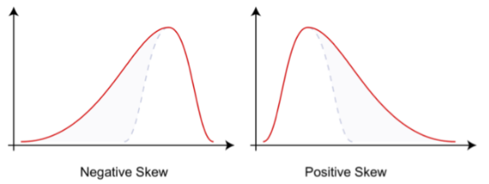

$\gamma_1 = 0$ — необходимое, но не достаточное условие симметричности:

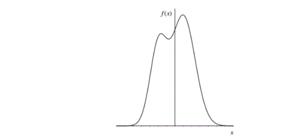

Коэффициент эксцесса (excess, без вычитания тройки — kurtosis):

$$ \gamma_2 = \frac{\mathbb{E}(X - \mathbb{E}X)^4}{(\mathbb{D}X)^2} - 3 $$

---

## 2. **Распределение Бернулли. Биномиальное распределение. Распределение Пуассона. Распределения, производные от нормального: хи-квадрат, Стьюдента, Фишера. Определения, графики, свойства, примеры.**

### **Распределе́ние Берну́лли** — дискретное распределение вероятностей, моделирующее случайный эксперимент произвольной природы, при заранее известной вероятности успеха или неудачи. (Частный случай биномиального с n = 1)

$$X \in \{ 0,1 \} \sim Ber(p), p \in (0,1)$$

$$
\begin{align*}
F\left(x\right) & =\begin{cases}
0, & x<0,\\
1-p, & 0\leqslant x<1,\\
1, & x\geqslant 1.
\end{cases}\\
f\left(x\right) & =\begin{cases}
1-p, & x=0,\\
p, & x=1.
\end{cases}
\end{align*}
$$

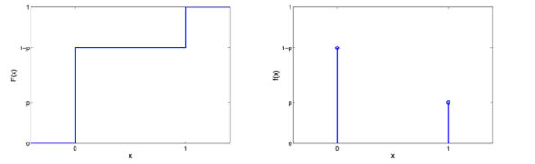

**Свойтсва:**

Предельное свойство описывается теоремой Пуассона:

Пусть есть последовательность серий испытаний Бернулли, где $p_n$ — вероятность «успеха», $\mu_n$ — количество «успехов».

Тогда если

1. $$\lim_{n \to \infty} p_n = 0; $$
2. $$\lim_{n \to \infty} np_n = \lambda; $$
3. $$\lambda > 0, $$

то $$\lim_{n \to \infty} P(\omega : \mu_n(\omega) = m) = e^{-\lambda} \frac{\lambda^m}{m!}. $$

**Моменты:**

$$E[X] = p.$$

$$D[X] = p(1 - p) = pq, \text{ так как } E X^2 - (E X)^2 = p - p^2 = p \cdot (1 - p) = pq.$$

Вообще, легко видеть, что

$$E[X^n] = Pr(X = 1) \cdot 1^n + Pr(X = 0) \cdot 0^n = p \cdot 1^n + q \cdot 0^n = p = E[X], \forall n \in \mathbb{N}$$

Пример: Подбрасывание монеты.

### **Биномиальное распределение** — дискретное распределение вероятностей случайной величины $X$, принимающей целочисленные значения $k=0,1,\ldots,n$ с вероятностями:  

$$P(x=k)=\binom{n}{k}p^{k}(1-p)^{n-k}.$$

Данное распределение характеризуется двумя параметрами: целым числом $n>0$, называемым числом испытаний, и вещественным числом $p,0\leq p\leq 1$, называемым вероятностью успеха в одном испытании.

$$X \in \{0,\ldots,N\} \sim Bin\left(N,p\right), N \in \mathbb{N}, p \in [0,1]$$

$$F\left(x\right) = I_{1-p}\left(N-x,1+x\right)$$

$$f\left(x\right) = C_N^x p^x \left(1-p\right)^{N-x}$$

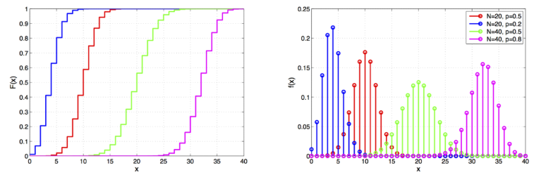

Свойства и моменты:

$$MX=np$$.  

$$DX=np(1-p)$$.

Пример: Стрельба по мишени

Стрелок попадает в цель с вероятностью $p = 0.8$. Он делает $n = 5$ выстрелов. Какова вероятность, что он попадет ровно 3 раза?

$$P(X = 3) = C_8^3 \cdot 0.8^3 \cdot 0.2^5 = 10 \cdot 0.512 \cdot 0.00032 = 0.2048 \quad (20.48\%).$$

### **Распределение Пуассона** - распределение числа независимых событий в фиксированном временном или пространственном интервале.

$$X \in \{0,1,2,\ldots\} \sim Pois(\lambda), \quad \lambda > 0$$

$$
\begin{align*}
&F(x) = e^{-\lambda} \sum_{i=0}^{\lfloor x \rfloor} \frac{\lambda^i}{i!} \\
&f(x) = e^{-\lambda} \frac{\lambda^x}{x!}
\end{align*}
$$

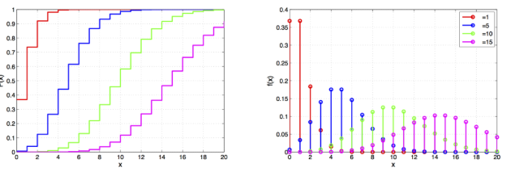

Свойства и моменты:

$$\mathbb{E}X = \mathbb{D}X = \lambda$$

Пусть $X_1, \ldots, X_n$ независимы, $X_i \sim Pois(\lambda_i)$, тогда  
$$\sum_{i=1}^n X_i \sim Pois\left( \sum_{i=1}^n \lambda_i \right)$$

Eсли $X \sim Pois(\lambda)$, $Y = \sqrt{X}$, то при больших $\lambda$  
$$F_Y(x) \approx \Phi\left( \frac{x - \sqrt{\lambda}}{\sqrt{\lambda}} \right)$$

$Bin(n,p) \rightarrow_{n \to \infty} Pois(\lambda)$ при постоянном $np$  

Пример: количество изюма в булочке с изюмом

### **Распределение хи-квадрат** - eсли взять $k$ независимых случайных величин $Z_1, Z_2, \ldots, Z_k$, каждая из которых имеет **стандартное нормальное распределение** $N(0, 1)$, то сумма их квадратов будет иметь распределение хи-квадрат с $k$ степенями свободы:

$$X = \sum_{i=1}^k Z_i^2 \sim \chi^2(k)$$

$$X \in \mathbb{R}_+ \sim \chi_k^2, \quad k \in \mathbb{N}$$

$$F\left( x \right) = \frac{1}{\Gamma \left( \frac{k}{2} \right)} \gamma \left( \frac{k}{2}, \frac{x}{2} \right)$$

$$f\left( x \right) = \frac{1}{2^{\frac{k}{2}} \Gamma \left( \frac{k}{2} \right)} x^{\frac{k}{2} - 1} e^{-\frac{x}{2}}$$

$$\Gamma(a) = \int_0^\infty e^{-t} t^{a-1} dt \quad \text{— гамма-функция}$$

$$\gamma(a, x) = \int_0^x e^{-t} t^{a-1} dt \quad \text{— нижняя неполная гамма-функция}$$

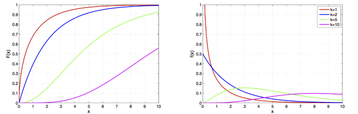

Свойтсва и моменты:

$$E[Y] = k$$

$$D[Y] = 2k$$

Пример: 

### Распределение Стьюдента

$$X \in \mathbb{R} \sim St(\nu), \quad \nu > 0$$

$$F(x) = \frac{1}{2} + x \Gamma\left(\frac{\nu+1}{2}\right)$$

$$f(x) = \frac{\Gamma\left(\frac{\nu+1}{2}\right)}{\sqrt{\nu\pi}\,\Gamma\left(\frac{\nu}{2}\right)} \left(1 + \frac{x^2}{\nu}\right)^{-\frac{\nu+1}{2}}$$

Свойства и моменты:

$\mathbb{E}X = 0$ при $\nu > 1$, $\text{med}\,X = \text{mode}\,X = 0$ всегда

$D[X] = \frac{n}{n-2}$

Пусть $Z \sim N(0,1)$ и $V \sim \chi^2_{\nu}$ независимы, тогда

$$T = \frac{Z}{\sqrt{V/\nu}} \sim St(\nu)$$

если $X \sim St(\nu)$, то

$$Y = \lim_{\nu \to \infty} X \sim N(0,1)$$

Пример: возникает при оценке среднего значения случайной величины с неизвестной дисперсией

### Распределение Фишера

Пусть $X_1 \sim \chi_{d_1}^2$, $X_2 \sim \chi_{d_2}^2$, $X_1$ и $X_2$ независимы, тогда  

$$\frac{X_1 / d_1}{X_2 / d_2} \sim F(d_1, d_2)$$

Если $X \sim F(d_1, d_2)$, то  

$$Y = \lim_{d_2 \to \infty} d_1 X \sim \chi_{d_1}^2$$

$$F(x; d_1, d_2) = F(1/x; d_2, d_1)$$

$$X \in \mathbb{R}_+ \sim F(d_1, d_2), \quad d_1, d_2 > 0$$

$$F(x) = I_{\frac{d_1 x}{d_1 x + d_2}} \left( \frac{d_1}{2}, \frac{d_2}{2} \right)$$

$$f(x) = \sqrt{\frac{(d_1 x)^{d_1} d_2^{d_2}}{(d_1 x + d_2)^{d_1 + d_2}}} \left( x B \left( \frac{d_1}{2}, \frac{d_2}{2} \right) \right)$$

$$B(a, b) = \int_0^1 t^{a-1} (1-t)^{b-1} dt \quad \text{— бета-функция}$$

$$I_x(a, b) = \frac{B(x; a, b)}{B(a, b)} \quad \text{— регуляризованная неполная бета-функция}$$

$$B(x; a, b) = \int_0^x t^{a-1} (1-t)^{b-1} dt \quad \text{— неполная бета-функция}$$

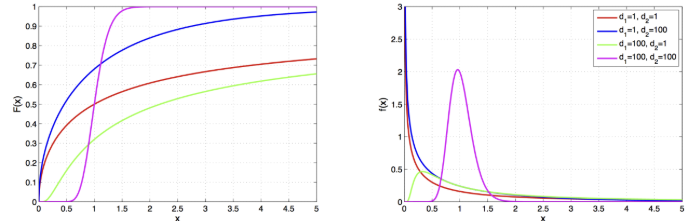

Свойства и моменты:

Его форма определяется двумя параметрами — степенями свободы числителя и знаменателя.

$$E[X] = \frac{d_2}{d_2 - 2}, \quad \text{при } d_2 > 2$$

**Важное условие:** Если $d_2 \leq 2$, математическое ожидание не определено (бесконечно).

$$\text{Var}(X) = \frac{2d_2^2(d_1 + d_2 - 2)}{d_1(d_2 - 2)^2(d_2 - 4)}, \quad \text{при } d_2 > 4$$

**Важное условие:** Дисперсия существует только в том случае, если число степеней свободы знаменателя строго больше $4$. Если $d_2 \leq 4$, дисперсия не определена.

Пример: возникает в дисперсионном и регрессионном анализе

---

## 3.Нормальное распределение: стандартное и с параметрами μ, σ. Приведение к стандартному виду. Определения, графики, свойства, примеры. Правило трёх сигм. Теорема Крамера. ЦПТ.

$$X \in \mathbb{R} \sim N\left(\mu, \sigma^2\right), \quad \sigma^2 > 0$$

$$F(x) = \Phi \left( \frac{x - \mu}{\sigma} \right)$$

$$f(x) = \frac{1}{\sigma} \phi \left( \frac{x - \mu}{\sigma} \right)$$

$$\Phi (x) = \frac{1}{\sqrt{2\pi}} \int_{-\infty}^{x} e^{-\frac{t^2}{2}} dt$$

$$\phi (x) = \frac{1}{\sqrt{2\pi}} e^{-\frac{x^2}{2}}$$

Стандартное нормальное распределение - Это частный случай, когда $\mu = 0$, а $\sigma = 1$. Обозначается как $Z \sim N(0, 1)$. Его плотность упрощается до:

$$\phi(z) = \frac{1}{\sqrt{2\pi}} e^{-\frac{z^2}{2}}$$

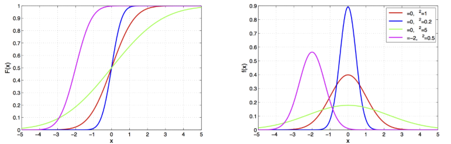

Свойства и моменты:

**предельное распределение суммы слабо взаимозависимых случайных величин**

$\mathbb{E} X = \text{med } X = \text{mode } X = \mu$, $\mathbb{D} X = \sigma^2$, все моменты более высокого порядка нулевые

**Сумма нормальных распределений(или линейная комбинация):**

**пусть** $X_1, \ldots, X_n$ **независимы,** $X_i \sim N\left(\mu_i, \sigma_i^2\right)$, **тогда** $\forall a_1, \ldots, a_n$  

$$\sum_{i=1}^n a_i X_i \sim N \left( \sum_{i=1}^n a_i \mu_i, \sum_{i=1}^n a_i^2 \sigma_i^2 \right)$$

Пример: погрешность измерения

### Приведение к стандартному виду (Z-преобразование)

Любую нормальную величину $X$ можно превратить в стандартную $Z$. Это нужно для использования статистических таблиц:

$$Z = \frac{X - \mu}{\sigma}$$

Это действие называют **центрированием** (вычитаем $\mu$) и **нормированием** (делим на $\sigma$).

### **Правило трёх сигм** — это эмпирическое правило, которое позволяет быстро оценить разброс данных в нормальном распределении. Оно гласит, что практически все значения (99.7%) нормально распределённой случайной величины лежат в интервале $\pm 3\sigma$ от её среднего значения $\mu$.

### Суть правила

Для нормального распределения вероятность того, что случайная величина отклонится от своего математического ожидания, распределяется следующим образом:

1. **$1\sigma$ (Правило 68%):** Около 68.27% данных лежат в пределах одного стандартного отклонения от среднего $[\mu - \sigma; \mu + \sigma]$.  
2. **$2\sigma$ (Правило 95%):** Около 95.45% данных лежат в пределах двух стандартных отклонений от среднего $[\mu - 2\sigma; \mu + 2\sigma]$.  
3. **$3\sigma$ (Правило 99.7%):** Около 99.73% данных лежат в пределах трёх стандартных отклонений от среднего $[\mu - 3\sigma; \mu + 3\sigma]$.

Это правило — главный инструмент для поиска аномалий (выбросов). Если какое-то значение выходит за пределы трёх сигм, оно считается крайне маловероятным (вероятность всего 0.27%) и, скорее всего, вызвано какой-то ошибкой или экстраординарным фактором.

### Теорема Крамера

Пусть случайная величина $\xi$ имеет нормальное распределение и представима в виде суммы двух независимых случайных величин  
$$\xi = \xi_1 + \xi_2.$$
Тогда $\xi_1$ и $\xi_2$ также нормально распределены.

### ЦПТ

**центральная предельная теорема:** пусть $X_1, \ldots, X_n$ **i.i.d. с $\mathbb{E}X$ и $\mathbb{D}X < \infty$, тогда**

$$\frac{1}{n} \sum_{i=1}^n X_i \sim N \left( \mathbb{E} X, \frac{\mathbb{D} X}{n} \right)$$

Если вы возьмете большое количество независимых случайных величин с любым распределением (даже очень странным), их сумма или среднее значение будет стремиться к нормальному распределению при увеличении числа слагаемых.

---

## 4.Генеральная совокупность. Выборка. Эмпирическая функция распределения. Теорема Гливенко — Кантелли. Гистограмма частот. Статистика (функция выборки). Статистики, используемые для оценки характеристик распределений. выборочные моменты, порядковая статистика, интерквартильный размах. Боксплот (ящик с усами).

**Генеральная совокупность** — множество объектов, свойства которых подлежат изучению в рассматриваемой задаче.

**Выборка** — конечное множество объектов, отобранных из генеральной совокупности для проведения измерений.

$$X^n = (X_1, \ldots, X_n).$$

$n$ — объём выборки.

$X^n$ — **простая выборка**, если $X_1, \ldots, X_n$ — независимые одинаково распределённые случайные величины (i.i.d.).

Основная задача статистики — описание $F_X(x)$ по реализации выборки.

**Функция распределения**

$$F_n(x) = \frac{1}{n} \sum_{i=1}^n \mathbb{I}[X_i \leq x]$$ — **эмпирическая функция распределения.**

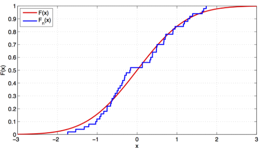

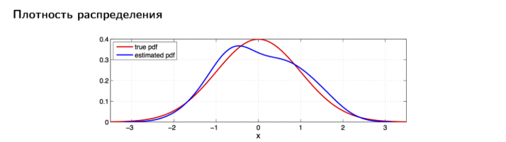

**Теорема Гливе́нко — Канте́лли** в математической статистике уточняет результат о сходимости выборочной функции распределения к её теоретическому аналогу.

Пусть $X_1, \ldots, X_n, \ldots$ — бесконечная выборка из распределения, задаваемого функцией распределения $F$.

Пусть $\hat{F}$ — выборочная функция распределения, построенная на первых $n$ элементах выборки. Тогда

$$\lim_{n \to \infty} \sup_{x \in \mathbb{R}} |\hat{F}(x) - F(x)| = 0$$

почти наверное,

где символ $\sup$ обозначает точную верхнюю грань.

Гистограмма частот — это ступенчатый график в виде прямоугольников, показывающий распределение числовых данных: ось X делит данные на интервалы (классы), а высота каждого столбика отражает частоту (количество) значений, попавших в этот интервал.

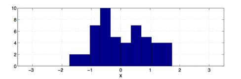

**Статистика $T(X^n)$** — любая измеримая функция выборки. Например:

Выборочное среднее: 

$$\bar{X} = \frac{1}{n} \sum_{i=1}^{n} X_i$$

Выборочная дисперсия: 

$$S^2 = \frac{1}{n-1} \sum_{i=1}^{n} (X_i - \bar{X})^2$$

Вариационный ряд - $X_{(1)} \leq X_{(2)} \leq \ldots \leq X_{(n)}$ , где

ранг элемента выборки - $X_i$: $\text{rank}(X_i) = r \quad \text{такой, что } X_i = X_{(r)}$

$k$-я порядковая статистика: $X_{(k)}$

Выборочный $\alpha$-квантиль: $X_{(\lfloor \alpha n \rfloor)}$

Выборочная медиана:  

  $$m = 
  \begin{cases} 
    X_{(k+1)}, & \text{если } n = 2k + 1, \\
    \frac{X_{(k)} + X_{(k+1)}}{2}, & \text{если } n = 2k.
  \end{cases}$$

Выборочный интерквартильный размах: 

$$IQR_n = X_{(\lfloor 0.75n \rfloor)} - X_{(\lfloor 0.25n \rfloor)}$$

Выборочный коэффициент асимметрии: 

$$g_1 = \sqrt{n} \frac{\sum_{i=1}^{n} (X_i - \bar{X})^3}{\left( \sum_{i=1}^{n} (X_i - \bar{X})^2 \right)^{3/2}}$$

Выборочный коэффициент эксцесса: 

$$g_2 = \frac{n \sum_{i=1}^{n} (X_i - \bar{X})^4}{\left( \sum_{i=1}^{n} (X_i - \bar{X})^2 \right)^2} - 3$$

Боксплот (или ящик с усами) — это графическое представление, используемое для визуализации распределения данных через показатели центра (медиана), разброса (квартили) и наличие выбросов. Внешне боксплот представляет собой прямоугольник (ящик), высота которого показывает интерквартильный размах (разницу между верхним и нижним квартилями), внутри которого находится линия, отображающая медиану. От ящика выходят "усы", которые простираются до минимального и максимального наблюдаемого значения, за исключением выбросов.

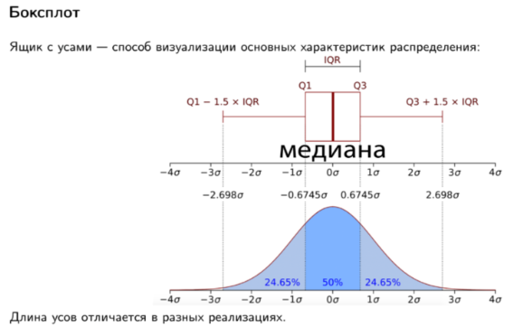

---

## 5.Точечные оценки параметров распределения, свойства. Метод моментов. Метод максимального правдоподобия, свойства.

Пусть распределение генеральной совокупности параметрическое:

$$F(x) = F(x, \theta).$$

Статистика $\hat{\theta}_n = \hat{\theta}(X^n)$ — **точечная оценка параметра $\theta$.**

Какая оценка лучше?

**Состоятельность:**

$$\lim_{n \to \infty} \hat{\theta}_n = \theta.$$

**Несмещённость:**

$$\mathbb{E}\hat{\theta}_n = \theta.$$

**Асимптотическая несмещённость:**

$$\lim_{n \to \infty} \mathbb{E}\hat{\theta}_n = \theta.$$

**Оптимальность:**

$$\mathbb{D}\hat{\theta}_n = \min_{\hat{\theta}_1 \in \mathcal{U}} \mathbb{D}\hat{\theta}_1,$$

где $\mathcal{U}$ — класс несмещённых оценок.

**Робастность:**

устойчивость $\hat{\theta}_n$ относительно

- отклонений истинного распределения $X$ от модельного семейства

- выбросов, содержащихся в выборке

### Метод моментов

**Оценка одного параметра.** Пусть известен вид плотности распределения $f(x, \theta)$, зависящей от одного параметра $\theta$, но не известно значение этого параметра.

Для нахождения его оценки достаточно составить одно уравнение, например, для начальных моментов первого порядка:  
$$\bar{x}_B = M(X).$$

Так как математическое ожидание признака генеральной совокупности

$$M(X) = \int_{-\infty}^{\infty} x \cdot f(x, \theta) dx = \varphi(\theta)$$

зависит от неизвестного параметра $\theta$, а выборочное среднее

$$\bar{x}_B = \frac{x_1 + x_2 + \cdots + x_n}{n}$$

зависит от реализации выборки

$$x_1, x_2, \ldots, x_n,$$

то после решения уравнения

$$\varphi(\theta) = \frac{x_1 + x_2 + \cdots + x_n}{n}$$

мы получаем

$$\theta^* = \psi(x_1, x_2, \ldots, x_n)$$

— оценку неизвестного параметра как функцию значений конкретной выборки.

### Метод максимального правдоподобия

**Дискретные случайные величины.** Пусть $X$ – дискретная случайная величина, для которой в результате опыта получена выборка значений $x_1, x_2, \ldots, x_n$. Вид закона распределения известен; закон содержит неизвестный параметр $\theta$, для которого требуется найти точечную оценку на основании данных выборки.

Обозначим вероятность $P(X = x_i) = p(x_i; \theta),\; i = 1, 2, \ldots, n$.

**Функцией правдоподобия** дискретной случайной величины $X$ называют функцию аргумента $\theta$ и данной выборки $x_1, x_2, \ldots, x_n$:

$$L(x_1, x_2, \ldots, x_n; \theta) = p(x_1; \theta) \cdot p(x_2; \theta) \cdot \ldots \cdot p(x_n; \theta).$$

В качестве точечной оценки параметра $\theta$ принимается значение $\theta^* = \theta^*(x_1, x_2, \ldots, x_n)$, при котором функция правдоподобия достигает наибольшего значения. Полученную оценку называют **оценкой максимального правдоподобия**.

Так как функции $L$ и $\ln L$ достигают максимума при одном и том же значении $\theta$, при практических вычислениях чаще используют вторую функцию, называемую **логарифмической функцией правдоподобия**:

$$\ln L(x_1, x_2, \ldots, x_n; \theta) = \ln p(x_1; \theta) + \ln p(x_2; \theta) + \ldots + \ln p(x_n; \theta).$$

Свойства:

- **состоятельность:**

$$\lim_{n \to \infty} \hat{\theta}_{MLE} = \theta$$

- **асимптотическая нормальность:** при $n \to \infty$

$$\hat{\theta}_{MLE} \sim N \left( \theta, I^{-1}(\theta) \right)$$

- **эффективность:** ОМП имеют наименьшую дисперсию среди всех состоятельных оценок  
- **инвариантность:**

$$g \left( \hat{\theta}_{MLE} \right) \text{ — ОМП-оценка для } g(\theta)$$

---

## 6.Квантили и построение доверительных интервалов. Интервальные оценки с помощью квантилей: для нормального распределения, для ненормальных распределений. Отличие z-доверительного интревала. Бутстреп-распределение, базовый бутстреп, свойства.

Квантили — это значения, разделяющие упорядоченный набор данных на равные доли. Например, медиана является вторым квартилем (т.е. 50%-квантилью).

Квантиль порядка $\alpha \in (0, 1)$:

$$X_\alpha : P(X \leq X_\alpha) \geq \alpha, \, P(X \geq X_\alpha) \geq 1 - \alpha$$

Интервальная оценка неизвестного параметра $\Theta$ – случайные функции $\Theta_1^* (X_1, X_2, \ldots, X_n)$ и $\Theta_2^* (X_1, X_2, \ldots, X_n)$ такие, что

$$P (\Theta_1^* < \Theta < \Theta_2^*) = \gamma = 1 - \alpha,$$  

т.е. интервал $(\Theta\_1^{\*}, \Theta\_2^{\*})$ заключает в себе (покрывает) неизвестный параметр $\Theta$ с вероятностью $\gamma$.  

Сам интервал носит название **доверительного интервала**, величина $\gamma = 1 - \alpha$ называется **доверительной вероятностью** оценки (надёжностью, коэффициентом доверия), числа $\Theta_1^{\*}$ и $\Theta_2^{\*}$ – **доверительными границами**, $\alpha$ – **уровнем значимости**.

Непараметрический доверительный интервал для медианы непрерывного распределения.

$$X^n = (X_1, \ldots, X_n), \quad X \sim F(x) \Rightarrow$$

$$\mathbf{P}(X_{(r)} \leq \text{med}\,X) = \sum_{i=r+1}^n C_n^i \frac{1}{2^i} \cdot \frac{1}{2^{n-i}},$$

$$\mathbf{P}(\text{med}\,X \in [X_{(r)}, X_{(n-r+1)}]) = \frac{1}{2^n} \sum_{i=r}^{n-r+1} C_n^i.$$

При $n > 10$ применима нормальная аппроксимация:

$$\mathbf{P}\left(\text{med}\,X \in \left[ X_{\left(\frac{n-\sqrt{n}z_{1-\alpha/2}}{2}\right)} ,\; X_{\left(\frac{n+\sqrt{n}z_{1-\alpha/2}}{2}\right)} \right] \right) \approx 1 - \alpha.$$

Аналогично строится непараметрический доверительный интервал для любого квантиля $X_\alpha, \alpha \in (0, 1)$:

$$\mathbf{P}(X_\alpha \in [X_{(l)}, X_{(u)}]) = \sum_{i=l}^u C_n^i \alpha^i (1 - \alpha)^{n-i}.$$

**Параметрический метод**

Параметрический метод используется, когда предполагается известная форма распределения данных и известные параметры этого распределения. Например, если данные приближаются нормальным распределением, то используются формулы для построения доверительных интервалов на основе стандартного нормального распределения или распределения Стьюдента в зависимости от известности или неизвестности дисперсии.

**Пример:**

**Доверительный интервал для среднего с известной дисперсией:**

$$\left[ \bar{X} - z_{\alpha/2} \frac{\sigma}{\sqrt{n}},\; \bar{X} + z_{\alpha/2} \frac{\sigma}{\sqrt{n}} \right]$$

где $\bar{X}$ — выборочное среднее, $\sigma$ — известное стандартное отклонение, $z_{\alpha/2}$ — квантиль стандартного нормального распределения.

**Наивный метод**

Наивный метод _(или метод “по-быстрому”)_ используется без предположений о распределении данных или их параметрах. Он основывается на статистической интуиции и может быть применён в ситуациях, когда нет точной информации о распределении или мало данных для более сложных методов.

**Пример:**

Доверительный интервал для доли:  

$$\left[ \hat{p} - z_{\alpha/2} \sqrt{\frac{\hat{p}(1 - \hat{p})}{n}},\; \hat{p} + z_{\alpha/2} \sqrt{\frac{\hat{p}(1 - \hat{p})}{n}} \right]$$

где $\hat{p}$ — выборочная доля, $z_{\alpha/2}$ — квантиль стандартного нормального распределения.

**Бутстрэп**

**Бутстрэп** — это метод, который позволяет оценить распределение выборочной статистики путем повторного выбора элементов из исходной выборки с возвращением. Этот метод особенно полезен, когда данные сложно распределены или необходимо оценить нестандартные статистики.

Процесс бутстрэпа:

- Сгенерировать много подвыборок (бутстреп-выборок) из исходной выборки.
- Для каждой бутстреп-выборки вычислить интересующую статистику (например, среднее, медиану, долю и т.д.).
- Построить распределение статистики на основе бутстреп-выборок и вычислить доверительный интервал, например, через квантили полученного распределения.

**Бутстреп-распределение**

$X_1^{\*}, \ldots, X_n^{\*}$ — бутстреп-псевдовыборка объёма $n$ из $X^n$,

$\theta_1^{\*}, \ldots, \theta_B^{\*}$ — значения статистики на них,

$\hat{F}_\theta^{\*}(x)$ — бутстреп-распределение $\theta^{\*}$, эмпирическая функция распределения, построенная по значениям статистики на псевдовыборках.

Возьмём выборочные квантили бутстреп-распределения:

$$P\left(\left(F_{\theta_n}^{boot}\right)^{-1} \left(\frac{\alpha}{2}\right)\leqslant\theta\leqslant\left(F_{\theta_n}^{boot} \right)^{-1}\left(1-\frac{\alpha}{2}\right)\right)\approx 1-\alpha.$$

Это **базовый бутстреп**.

**Свойства бутстрепа**

- асимптотическая состоятельность  
- простота использования даже для самых сложных статистик  
- плохо работает для статистик, значение которых зависит от небольшого числа элементов выборки

**Интервальные оценки с помощью квантилей** используются для оценки диапазона значений параметра с заданной вероятностью.

**Интервальные оценки**

Доверительный интервал: $$P(\theta \in [C_L, C_U]) \geq 1 - \alpha,$$

$1 - \alpha$ — уровень доверия,  
$C_L, C_U$ — нижний и верхний доверительные пределы.

**Неверная интерпретация:** неизвестный параметр лежит в пределах построенного доверительного интервала с вероятностью $1 - \alpha$.

**Верная интерпретация:** при бесконечном повторении процедуры построения доверительного интервала на аналогичных выборках в $100(1 - \alpha)\%$ случаев он будет содержать истинное значение $\theta$.

**Для нормального распределения**

$$X \sim N\left(\mu, \sigma^2\right), \quad X^n = (X_1, \ldots, X_n),$$

$\bar{X}_n$ — оценка $\mathbb{E}X = \mu$,

$$\bar{X}_n \sim N\left(\mu, \frac{\sigma^2}{n}\right) \Rightarrow P\left(\mu - z_{1-\frac{\alpha}{2}} \frac{\sigma}{\sqrt{n}} \leq \bar{X}_n \leq \mu + z_{1-\frac{\alpha}{2}} \frac{\sigma}{\sqrt{n}}\right) = 1 - \alpha \Rightarrow$$

доверительный интервал для $\mu$:

$$P\left(\bar{X}_n - z_{1-\frac{\alpha}{2}} \frac{\sigma}{\sqrt{n}} \leq \mu \leq \bar{X}_n + z_{1-\frac{\alpha}{2}} \frac{\sigma}{\sqrt{n}}\right) = 1 - \alpha,$$

$z_{1-\frac{\alpha}{2}}$ — квантиль стандартного нормального распределения.

**Для ненормальных распределений**

ЦПТ: если $X^n$ — выборка из $F(x)$, $F(x)$ не слишком скошена и $n > 30$, то

$$\bar{X}_n \approx N \left( \mathbb{E}X, \frac{\mathbb{D}X}{n} \right) \Rightarrow$$

доверительный интервал для $\mathbb{E}X$:

$$P \left( \bar{X}_n - z_{1-\frac{\alpha}{2}} \sqrt{\frac{\mathbb{D}X}{n}} \leq \mathbb{E}X \leq \bar{X}_n + z_{1-\frac{\alpha}{2}} \sqrt{\frac{\mathbb{D}X}{n}} \right) \approx 1 - \alpha.$$

Если дисперсия неизвестна:

$$P \left( \bar{X}_n - t_{n-1,1-\frac{\alpha}{2}} \frac{S_n}{\sqrt{n}} \leq \mathbb{E}X \leq \bar{X}_n + t_{n-1,1-\frac{\alpha}{2}} \frac{S_n}{\sqrt{n}} \right) \approx 1 - \alpha,$$

$t_{n-1,1-\frac{\alpha}{2}}$ — квантиль распределения Стьюдента с $n - 1$ степенью свободы.

**Z-доверительный интервал** используется, когда **известно стандартное отклонение генеральной совокупности** ($\sigma$) и/или **размер выборки большой** ($n > 30$). Он строится с помощью **Z-распределения (стандартного нормального распределения)**, в отличие от **t-интервала**, который применяется при неизвестном $\sigma$ и малых выборках, используя распределение Стьюдента, и даёт более широкие (менее точные) интервалы для малых данных.

Основное отличие Z-интервала — его основа на Z-статистиках (например, $1.96$ для $95\%$ ДИ) и применение при «идеальных» условиях, в то время как t-интервал более гибок для реальных, ограниченных данных.

---

## 7.Методика проверка параметрических гипотез с помощью: 1) p-value (достигаемый уровень значимости); 2) значения критерия; 3) доверительного интервала. Виды альтернатив, соответствующий p-value в каждом случае. Примеры гипотез.

**Общая схема проверки статистических гипотез включает следующие шаги:**

- Формулировка основной (нулевой) гипотезы $H_{0}$ (например, о равенстве параметра заданному значению) и альтернативной (конкурирующей) гипотезы $H_{1}$ (односторонняя или двусторонняя).
- Выбор статистического критерия — случайной величины, распределение которой известно (точное или приближенное) при условии истинности $H_{0}$
- Определение правил проверки (выбор уровня значимости $\alpha$, объема выборки)
- Расчет значения статистики по выборочным данным и принятие решения (отклонить или принять $H_{0}$) одним из трех способов

**1) Проверка с помощью p-value (достигаемый уровень значимости)**

**Суть метода:**

- Вычисляется p-value ($p$) — вероятность при справедливости нулевой гипотезы $H_{0}$ получить значение статистики критерия, равное наблюдаемому ($t$) или еще более экстремальному.
- Это вероятность $P(T \ge t | H_{0})$.

  Правило принятия решения:

  - Если $p(x^n) \le \alpha$ (уровень значимости), то гипотеза $H_{0}$ отвергается.
  - Если $p > \alpha$, гипотеза $H_{0}$ не отвергается.
 
**Пример:**
В задаче о среднем весе землероек ($H_0 : \mu = 90\, \text{г}$) при $\alpha = 0.05$ и $p = 0.0384$ гипотеза отвергается в пользу односторонней альтернативы $H_1 : \mu > 90\, \text{г}$.
 
**2) Проверка с помощью значения критерия (статистики критерия)**

**Суть метода:**

- До сбора данных выбирается уровень значимости $\alpha$
- Определяется критическая область ($S$) — множество значений критерия, при которых $H_{0}$ отклоняется, и область принятия гипотезы ($\overline{S}$)
- Границами этих областей служат критические точки (квантили распределения), которые находятся по таблицам (например, $z_{\alpha}$, $t_{crit}$, $F_{crit}$)

  Правило принятия решения:
  
  - Рассчитывается наблюдаемое значение критерия $\Theta_{набл}$ (или $Z_{obs}, t_{obs}$) по выборке
  - Если наблюдаемое значение попадает в критическую область ($\Theta_{набл} \in S$), гипотеза $H_{0}$ отклоняется
  - Если значение попадает в область принятия ($\Theta_{набл} \in \overline{S}$), гипотеза $H_{0}$ принимается (не отклоняется)

**Пример:**
Для z-критерия при $\alpha = 0.05$ и двусторонней альтернативе критические точки $z_{\text{кр}} = \pm 1.96$. Если $z_{\text{набл}} = 2.5 > 1.96$, то $H_0$ отвергается

**3) Проверка с помощью доверительного интервала**

**Суть метода:**

- На основе критического значения статистики (например, $t$) можно построить доверительный интервал для параметра популяции (например, для среднего $\mu$)
- Центром интервала является выборочное среднее

  Правило принятия решения:
  
  - Если значение параметра, предполагаемое в нулевой гипотезе (например, $\mu_0$), не попадает в построенный доверительный интервал (например, 95%-й), то гипотеза $H_{0}$ отвергается1919
  - Если значение попадает в интервал, гипотеза не отвергается

**Пример:**
Для среднего веса пушистых упаковок ($H_0 : \mu = 4\, \text{г}$) 95% доверительный интервал $[3.95, 5.25]$ содержит $4$ и поэтому $H_0$ не отвергается при двусторонней альтернативе

Вид альтернативы определяет способ расчёта p-value и выбор критической области.

**Типы альтернатив и расчёт p-value (на примере Z-критерия):**

1. Двусторонняя альтернатива (Two-tailed hypothesis)

  - **Формулировка:** $H_1 : \mu \neq \mu_0$ (параметр не равен заданному числу).  
    *Суть:* Нас интересуют отклонения в любую сторону (больше или меньше).
  
  - **P-value:** $p(Z) = 2(1 - F_{N(0,1)}(|Z|))$ — улавливается площадь «хвоста» распределения.  
  - **Критическая область:** Две области по краям распределения, границы определяются как $\alpha / 2$.

2. Односторонняя альтернатива (One-tailed hypothesis) — Правосторонняя

  - **Формулировка:** $H_1 : \mu > \mu_0$ (параметр больше заданного числа).  
  - **P-value:** $p(Z) = 1 - F_{N(0,1)}(Z)$ — площадь под кривой справа от наблюдаемого значения.  
  - **Критическая область:** Расположена справа, определяется из условия $P(\Theta > \Theta_2) = \alpha$.

3. Односторонняя альтернатива (One-tailed hypothesis) — Левосторонняя

  - **Формулировка:** $H_1 : \mu < \mu_0$ (параметр меньше заданного числа).  
  - **P-value:** $p(Z) = F_{N(0,1)}(Z)$ — площадь под кривой слева от наблюдаемого значения.  
  - **Критическая область:** Расположена слева, определяется из условия $P(\Theta < \Theta_1) = \alpha$.

Примеры гипотез:
1. Двусторонняя: Отличается ли средняя масса землероек в исследовании от табличной (90 г)? $H_{0}: \mu = 90$; $H_{1}: \mu \ne 90$
2. Односторонняя (правосторонняя): Весят ли землеройки больше 90 г? $H_{0}: \mu \le 90$; $H_{1}: \mu > 90$
3. О суде присяжных (сравнение долей): Была ли процедура отбора беспристрастной (доля женщин 0.5)? $H_{0}: p = 0.5$; $H_{1}: p < 0.5$ (предпочтение отдавалось мужчинам)

---

## 8.Проверка гипотез о доле признака (z-критерий для доли). Биномиальный критерий. Z-критерий для разности двух долей (незавиимые и связанные выборки).

**Z-критерий для одной доли (Сравнение с нормативом)**

Применяется, когда нужно проверить, равна ли доля признака $p$ в генеральной совокупности определенному значению $a$ (или $p_0$).

**Условия:** Выборка достаточно велика ($n$), чтобы использовать нормальное приближение биномиального закона.

**Гипотезы:** $H_{0}: p = p_0$ (или $p=a$) против альтернатив $p \ne p_0$, $p > p_0$ или $p < p_0$.

**Статистика критерия:**

$$Z = \frac{\hat{p} - p_0}{\sqrt{\frac{p_0(1-p_0)}{n}}}$$

Где $\hat{p} = m/n$ — выборочная доля.

**Распределение:** При $H_0$ статистика $Z \sim N(0,1)$.

**Пример:**
Проверка гипотезы $H_0 : p = 0.1$ при $n = 100$, $\hat{p} = 0.15$.
При $H_1 : p > 0.1$ и $\alpha = 0.05$ находим $z_{\text{набл}} = 1.67$, критическое значение $z_{\text{кр}} = 1.645$. Так как $1.67 > 1.645$, $H_0$ отвергается

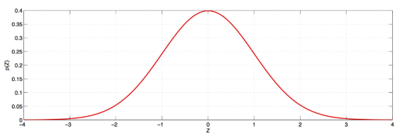

**Биномиальный критерий (Точный критерий)**

**Условия:** Малая выборка или необходимость точного решения.

**Статистика:** $T = \sum X_i$ (количество успехов $m$).

**Распределение:** При $H_0$ статистика $T \sim Bin(n, p_0)$.

**Достигаемый уровень значимости:**

$$p(T) =
\begin{cases} 
1 - F_{Bin(n, p_0)}(T - 1), & H_1 : p > p_0, \\
F_{Bin(n, p_0)}(T), & H_1 : p < p_0, \\
\text{через бета-распределение}, & H_1 : p \neq p_0.
\end{cases}$$

**Особенность:** Из-за дискретности распределения нельзя добиться, чтобы вероятность ошибки 1-го рода была ровно $\alpha$46. Доверительный интервал Клоппера-Пирсона основан на этом критерии.

**Пример:**
Проверка гипотезы $H_0 : p = 0.05$ при $n = 20$, $m = 2$.
Для $H_1 : p > 0.05$: $p = P(T \ge 2) = 0.2642$ (биномиальный расчёт)

**Z-критерий для разности двух долей (Независимые выборки)**

Сравниваются частоты появления признака в двух независимых совокупностях ($n_1$ и $n_2$).

**Условия:** Большие выборки ($n > 30$), распределение частот близко к нормальному.

**Выборки:** $X_{n_1}^1 \sim Ber(p_1)$, $X_{n_2}^2 \sim Ber(p_2)$.

$H_0 : p_1 = p_2$, $H_1 : p_1 \neq p_2$ (или $>$, $<$).

**Статистика:**

$$Z = \frac{\hat{p}_1 - \hat{p}_2}{\sqrt{P(1-P)\left(\frac{1}{n_1} + \frac{1}{n_2}\right)}}, \quad \text{где } P = \frac{\hat{p}_1 n_1 + \hat{p}_2 n_2}{n_1 + n_2}.$$

**Распределение:** $N(0, 1)$.

**Пример:**
Сравнение долей брака в двух партиях: $n_1 = 100$, $m_1 = 4$; $n_2 = 500$, $m_2 = 12$.

$$\hat{p}_1 = 0.04,\; \hat{p}_2 = 0.024,\; P = 0.027.$$

$$z_{\text{набл}} = 1.06,\; \text{при } \alpha = 0.05 \text{ критические значения } \pm 1.96.$$

$H_0$ не отвергается

**Z-критерий для разности двух долей (связанные выборки)**

**Условия:** Используется, когда одни и те же объекты проверяются дважды (например, "до" и "после") или выборки сопряжены. Данные представляются в таблице $2 \times 2$, где нас интересуют ячейки, в которых результат изменился (несовпадающие пары).

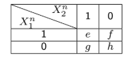

**Гипотеза:** $H_{0}: p_1 = p_2$.

**Статистика:**

$$Z = \frac{f - g}{\sqrt{f + g}}$$

**Распределение:** $N(0,1)$.

**Пример:**
Оценка изменения рейтинга премьер-министра в двух опросах –  
$e = 794$, $f = 150$, $g = 86$, $h = 570$, $n = 1600$.  
$z_{набл} = 4.47$, $p\text{-value} \approx 2.8 \times 10^{-6}$, $H_0$ отвергается

---

## 9.Сравнение различий в средних: z-критерий; t-критерии Стьюдента для независимых и связанных выборок; случаи, если дисперсии выборок не равны. Формирование выборок (условия применимости) для параметрических критериев. Примеры.

Z-критерий (z-test) используется для сравнения среднего значения выборки с известным средним значением популяции, когда дисперсия популяции известна. Это одновыборочный критерий, который проверяет, отличается ли среднее в выборке от заданного числа.

**Статистика:**

$$z = \frac{\bar{X} - \mu}{\sigma_{\bar{X}}}$$

где $\bar{X}$ — среднее выборки, $\mu$ — среднее популяции, $\sigma_{\bar{X}} = \frac{\sigma}{\sqrt{n}}$ — стандартная ошибка среднего (SE), $\sigma$ — стандартное отклонение популяции, n — размер выборки.

**Z-критерий** предполагает нормальное распределение в популяции и известную дисперсию. Он более "строгий", чем t-критерий, так как не учитывает оценку дисперсии из выборки, что делает критические значения меньше.

**Пример:**

Проверка гипотезы о том, отличается ли средняя масса землероек в исследовании от 90 г при известном $\sigma = 20$ и $n = 25$.

$$H_0 : \mu = 90, \quad H_1 : \mu \neq 90$$

Расчёт критических значений $z_{кр} = \pm 1.96$ при $\alpha = 0.05$. Если $z_{набл}$ попадает в критическую область, $H_0$ отвергается.

**t-критерий Стьюдента для независимых выборок** — двухвыборочный критерий для сравнения средних двух независимых групп, когда дисперсия популяции неизвестна. Он проверяет, получены ли выборки из одной популяции или равны ли их средние. Формулировка гипотез: H₀: $\mu_1 = \mu_2$ (или $\mu_1 - \mu_2 = 0$), H₁: $\mu_1 \neq \mu_2$ (двусторонняя) или односторонняя (например, $\mu_1 > \mu_2$).

**Статистика:**

$$t = \frac{\overline{X}_1 - \overline{X}_2}{S_{\overline{X}_1 - \overline{X}_2}}, \quad S_{\overline{X}_1 - \overline{X}_2} = \sqrt{\frac{s_{pooled}^2}{n_1} + \frac{s_{pooled}^2}{n_2}}$$

где $s_{pooled}^2$ — объединённая дисперсия. Степени свободы: df = n₁ + n₂ - 2.

**Условия применения:**

- Выборки независимы, нормальное распределение в каждой.
- Дисперсии равны (проверяется F-критерием).
- Размер выборок: n ≥ 10 в каждой, предпочтительно ≥30.
- Размеры выборок могут отличаться.

**Процесс:** 

Сначала проверить нормальность и равенство дисперсий (F-test: если p ≤ 0.05, дисперсии не равны — использовать вариант Уэлча). Затем рассчитать t, сравнить с критическим (из таблиц t-распределения). Если |t| > критическое, отвергнуть H₀. Зависит от различий средних, изменчивости и размеров выборок.

**Пример:**

Сравнение массы тигров-самцов и самок.

$$H_0 : \mu_1 = \mu_2, \quad H_1 : \mu_1 \neq \mu_2$$

Проверка равенства дисперсий с помощью F-критерия, затем расчёт t-статистики.

**t-критерий Стьюдента для связанных выборок** используется для сравнения средних в двух связанных группах (например, до и после вмешательства на одних и тех же объектах). Это эквивалентно одновыборочному t-тесту на разностях (D = значение после - значение до). Гипотезы: H₀: $\mu_D = 0$ (нет изменений), H₁: $\mu_D \neq 0$ (двусторонняя) или односторонняя.

**Статистика:**

 $$  t = \frac{\bar{D}}{s_{\bar{D}}}  $$
 
 где $\bar{D}$ — средняя разность, $s_{\bar{D}} = \frac{s_D}{\sqrt{n}}$, s_D — стандартное отклонение разностей, df = n - 1 (n — число пар).

**Условия:** 
Выборки связаны (одни и те же объекты), нормальное распределение разностей, нет требования равенства дисперсий исходных выборок (поскольку фокус на разностях). Размер: n ≥ 10, лучше ≥30.

**Преимущество:** 
Устраняет внутригрупповую изменчивость, повышая мощность по сравнению с независимыми выборками. Можно использовать тест для независимых, но рискуете не увидеть различий при большой изменчивости.

**Пример:**

Изменение массы тигров-самцов после прихода нового служителя.

$$H_0 : \mu_D = 0, \quad H_1 : \mu_D \neq 0$$

Расчёт среднего различия $D$ и t-статистики.

**Случаи, если дисперсии выборок не равны**

Если дисперсии в двух независимых выборках значительно различаются (гетерогенность), стандартный t-критерий может давать некорректные результаты.

**Решение: подход Уэлча (Welch's t-test)**

Используется модифицированная формула стандартной ошибки и скорректированные степени свободы.

Перед проведением t-теста необходимо проверить равенство дисперсий с помощью F-теста (критерий Фишера). Если $p \leq 0.05$, дисперсии считаются неравными, и применяется критерий Уэлча.

Для связанных выборок проблема дисперсий не актуальна, так как тест на разностях. Несоблюдение равенства дисперсий допустимо, если распределения нормальные и размеры выборок отличаются не более чем на 10%. Если нарушение сильное, переходите к непараметрическим альтернативам (например, U-критерий Манна-Уитни).

**Пример:**

В анализе массы тигров-самцов и самок сначала выполнен F-тест, который показал значимое различие дисперсий ($p = 2.98 \times 10^{-5}$), поэтому использован критерий Уэлча.

**Формирование выборок (условия применимости) для параметрических критериев**

Параметрические критерии (z, t, F и т.д.) предполагают определенные условия для выборок, чтобы результаты были надежными. Основные требования:

**1. Случайность измерений:**
Каждый элемент популяции должен иметь равную вероятность попасть в выборку.
Пример: случайное распределение животных в контрольную и экспериментальную группы.

**2. Независимость измерений:**
Отсутствие корреляции между наблюдениями (например, во времени или пространстве).
Пример: измерения массы разных особей, а не повторные измерения одной особи.

**3. Минимизация посторонней дисперсии:** 
Выровнять выборку так, чтобы влияние посторонних факторов было сведено на нет, либо в дальнейшем учитывать действие этих факторов. 
Пример: анализировать изменчивость размеров тела в разных популяциях лучше на особях одного пола и возраста.

**4. Нормальность распределения:**
Данные должны быть получены из популяции с нормальным распределением. Проверяется тестами:
- Shapiro–Wilk (предпочтительный)
- Lilliefors
- Kolmogorov–Smirnov
Пример: проверка нормальности распределения массы тигров.

**5. Гомогенность дисперсий:**
Дисперсии сравниваемых групп должны быть равны (проверяется F-тестом), если не равны это гетерогенность.
Пример: сравнение дисперсий массы самцов и самок тигров.

**6. Отсутствие выбросов (аутлаеров):**
Удалить или заменить крайние значения, сильно сдвигающие среднее. 
**Аутлаеры** – измерения, настолько сильно отличающиеся от остальных, что скорее всего, они не принадлежат к данной выборке. Они сильно сдвигают среднее значение.
Пример: удаление аномально высокой массы особи из анализа.

**7. Достаточный размер выборки:** (в лекциях нет)
Для t-критериев n ≥ 10, лучше ≥30 в каждой группе. Небольшие отклонения от нормальности допустимы, если распределение симметрично, тест двусторонний, n равны.
Пример: в исследовании землероек n=25.
