## 1. **Отличие решаемых задач в теории вероятностей и математической статистики. Основная задача статистики. Вероятность. ЗБЧ. Описание случайных величин: дискретных и непрерывных. Характеристики распределений. Квантиль.**

**Теория вероятностей (ТВ) и математическая статистика (МС) решают обратные задачи**: ТВ предсказывает свойства выборок, зная закон распределения (параметры), а МС, наоборот, по выборке определяет этот закон и его параметры (мат. ожидание, дисперсию), оценивая достоверность. **Основная задача статистики** — анализ собранных данных для изучения закономерностей массовых явлений и получения выводов, используя методы ТВ для интерпретации случайности. 

**Вероятность события** — доля испытаний, завершившихся наступлением события, в бесконечном эксперименте.

**Закон больших чисел**: на больших выборках частота события хорошо приближает его вероятность.
Этот закон утверждает: если вы проводите один и тот же эксперимент много раз, то среднее арифметическое результатов будет стремиться к математическому ожиданию (теоретическому среднему).

$$\lim_{n \to \infty} P(|\overline{X}_n - \mu| < \varepsilon) = 1$$

**Дискретная случайная величина** $X$ принимает счётное множество значений A = {a₁, a₂, …}  с вероятностями $p_1, p_2, \ldots$ и $\sum_i p_i = 1$.

$$f_X(a_i) = P(X = a_i) = p_i$$ - функция вероятности(плотности).

**Непрерывная случайная величина** задаётся с помощью функции распределения:

$$F_X(x) = P(X \leq x)$$

или плотности распределения:

$$ f_X(x) : \int_a^b f_X(x) \, dx = P(a \leq X \leq b) $$

**Характеристики распределений**:

Матожидание — среднее значение $X$:

$$ EX = \int x \, dF(x) $$

Дисперсия — мера разброса $X$:

$$\mathbb{D}X = \mathbb{E} \left( (X - EX)^2 \right)$$

Квантиль порядка $\alpha \in (0, 1)$:

$$X_\alpha : P(X \leq X_\alpha) \geq \alpha, \, P(X \geq X_\alpha) \geq 1 - \alpha$$

Эквивалентное определение:

$$X_\alpha = F^{-1} (\alpha) = \inf \{ x : F(x) \geq \alpha \}$$

Медиана — квантиль порядка 0.5, центральное значение распределения:

$$\text{med } X : P(X \leq \text{med } X) \geq 0.5, \, P(X \geq \text{med } X) \geq 0.5$$

Интерквартильный размах:

$$IQR = X_{0.75} - X_{0.25}$$

Мода — точка максимума функции вероятности или плотности:

$$\text{mode } X = \arg \max_x f(x)$$

Коэффициент ассиметрии (skewness):

$$\gamma_1 = \mathbb{E} \left( \frac{X - EX}{\sqrt{\mathbb{D}X}} \right)^3$$

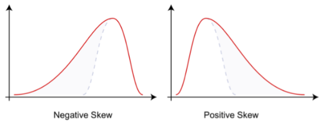

$\gamma_1 = 0$ — необходимое, но не достаточное условие симметричности:

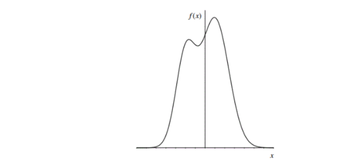

Коэффициент эксцесса (excess, без вычитания тройки — kurtosis):

$$ \gamma_2 = \frac{\mathbb{E}(X - \mathbb{E}X)^4}{(\mathbb{D}X)^2} - 3 $$

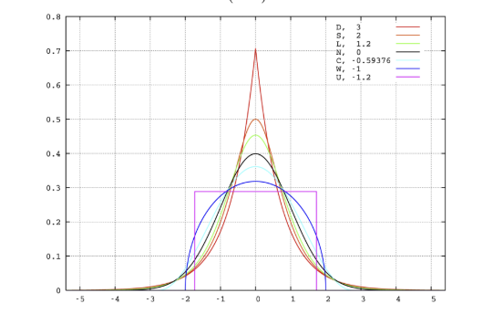

---

## 2. **Распределение Бернулли. Биномиальное распределение. Распределение Пуассона. Распределения, производные от нормального: хи-квадрат, Стьюдента, Фишера. Определения, графики, свойства, примеры.**

### **Распределе́ние Берну́лли** — дискретное распределение вероятностей, моделирующее случайный эксперимент произвольной природы, при заранее известной вероятности успеха или неудачи. (Частный случай биномиального с n = 1)

$$X \in \{ 0,1 \} \sim Ber(p), p \in (0,1)$$

$$
\begin{align*}
F\left(x\right) & =\begin{cases}
0, & x<0,\\
1-p, & 0\leqslant x<1,\\
1, & x\geqslant 1.
\end{cases}\\
f\left(x\right) & =\begin{cases}
1-p, & x=0,\\
p, & x=1.
\end{cases}
\end{align*}
$$

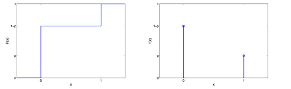

**Свойтсва:**

Предельное свойство описывается теоремой Пуассона:

Пусть есть последовательность серий испытаний Бернулли, где $p_n$ — вероятность «успеха», $\mu_n$ — количество «успехов».

Тогда если

1. $$\lim_{n \to \infty} p_n = 0; $$
2. $$\lim_{n \to \infty} np_n = \lambda; $$
3. $$\lambda > 0, $$

то $$\lim_{n \to \infty} P(\omega : \mu_n(\omega) = m) = e^{-\lambda} \frac{\lambda^m}{m!}. $$

**Моменты:**

$$E[X] = p.$$

$$D[X] = p(1 - p) = pq, \text{ так как } E X^2 - (E X)^2 = p - p^2 = p \cdot (1 - p) = pq.$$

Вообще, легко видеть, что

$$E[X^n] = Pr(X = 1) \cdot 1^n + Pr(X = 0) \cdot 0^n = p \cdot 1^n + q \cdot 0^n = p = E[X], \forall n \in \mathbb{N}$$

Пример: Подбрасывание монеты.

### **Биномиальное распределение** — дискретное распределение вероятностей случайной величины $X$, принимающей целочисленные значения $k=0,1,\ldots,n$ с вероятностями:  

$$P(x=k)=\binom{n}{k}p^{k}(1-p)^{n-k}.$$

Данное распределение характеризуется двумя параметрами: целым числом $n>0$, называемым числом испытаний, и вещественным числом $p,0\leq p\leq 1$, называемым вероятностью успеха в одном испытании.

$$X \in \{0,\ldots,N\} \sim Bin\left(N,p\right), N \in \mathbb{N}, p \in [0,1]$$

$$F\left(x\right) = I_{1-p}\left(N-x,1+x\right)$$

$$f\left(x\right) = C_N^x p^x \left(1-p\right)^{N-x}$$

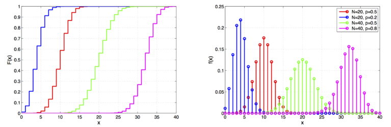

Свойства и моменты:

$$MX=np$$.  

$$DX=np(1-p)$$.

Пример: Стрельба по мишени

Стрелок попадает в цель с вероятностью $p = 0.8$. Он делает $n = 5$ выстрелов. Какова вероятность, что он попадет ровно 3 раза?

$$P(X = 3) = C_8^3 \cdot 0.8^3 \cdot 0.2^5 = 10 \cdot 0.512 \cdot 0.00032 = 0.2048 \quad (20.48\%).$$

### **Распределение Пуассона** - распределение числа независимых событий в фиксированном временном или пространственном интервале.

$$X \in \{0,1,2,\ldots\} \sim Pois(\lambda), \quad \lambda > 0$$

$$
\begin{align*}
&F(x) = e^{-\lambda} \sum_{i=0}^{\lfloor x \rfloor} \frac{\lambda^i}{i!} \\
&f(x) = e^{-\lambda} \frac{\lambda^x}{x!}
\end{align*}
$$

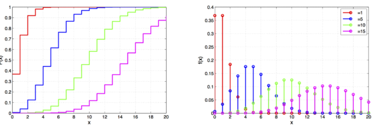

Свойства и моменты:

$$\mathbb{E}X = \mathbb{D}X = \lambda$$

Пусть $X_1, \ldots, X_n$ независимы, $X_i \sim Pois(\lambda_i)$, тогда  
$$\sum_{i=1}^n X_i \sim Pois\left( \sum_{i=1}^n \lambda_i \right)$$

Eсли $X \sim Pois(\lambda)$, $Y = \sqrt{X}$, то при больших $\lambda$  
$$F_Y(x) \approx \Phi\left( \frac{x - \sqrt{\lambda}}{\sqrt{\lambda}} \right)$$

$Bin(n,p) \rightarrow_{n \to \infty} Pois(\lambda)$ при постоянном $np$  

Пример: количество изюма в булочке с изюмом

### **Распределение хи-квадрат** - eсли взять $k$ независимых случайных величин $Z_1, Z_2, \ldots, Z_k$, каждая из которых имеет **стандартное нормальное распределение** $N(0, 1)$, то сумма их квадратов будет иметь распределение хи-квадрат с $k$ степенями свободы:

$$X = \sum_{i=1}^k Z_i^2 \sim \chi^2(k)$$

$$X \in \mathbb{R}_+ \sim \chi_k^2, \quad k \in \mathbb{N}$$

$$F\left( x \right) = \frac{1}{\Gamma \left( \frac{k}{2} \right)} \gamma \left( \frac{k}{2}, \frac{x}{2} \right)$$

$$f\left( x \right) = \frac{1}{2^{\frac{k}{2}} \Gamma \left( \frac{k}{2} \right)} x^{\frac{k}{2} - 1} e^{-\frac{x}{2}}$$

$$\Gamma(a) = \int_0^\infty e^{-t} t^{a-1} dt \quad \text{— гамма-функция}$$

$$\gamma(a, x) = \int_0^x e^{-t} t^{a-1} dt \quad \text{— нижняя неполная гамма-функция}$$

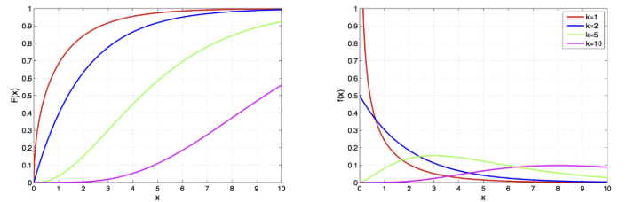

Свойтсва и моменты:

$$E[Y] = k$$

$$D[Y] = 2k$$

Пример: 

### Распределение Стьюдента

$$X \in \mathbb{R} \sim St(\nu), \quad \nu > 0$$

$$F(x) = \frac{1}{2} + x \Gamma\left(\frac{\nu+1}{2}\right)$$

$$f(x) = \frac{\Gamma\left(\frac{\nu+1}{2}\right)}{\sqrt{\nu\pi}\,\Gamma\left(\frac{\nu}{2}\right)} \left(1 + \frac{x^2}{\nu}\right)^{-\frac{\nu+1}{2}}$$

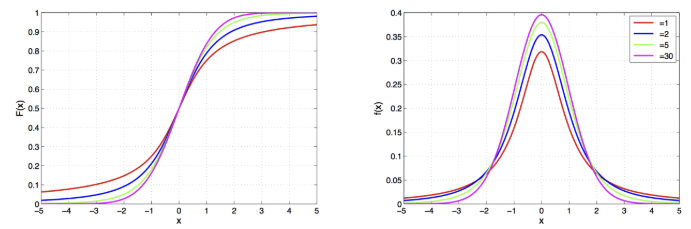

Свойства и моменты:

$\mathbb{E}X = 0$ при $\nu > 1$, $\text{med}\,X = \text{mode}\,X = 0$ всегда

$D[X] = \frac{n}{n-2}$

Пусть $Z \sim N(0,1)$ и $V \sim \chi^2_{\nu}$ независимы, тогда

$$T = \frac{Z}{\sqrt{V/\nu}} \sim St(\nu)$$

если $X \sim St(\nu)$, то

$$Y = \lim_{\nu \to \infty} X \sim N(0,1)$$

Пример: возникает при оценке среднего значения случайной величины с неизвестной дисперсией

### Распределение Фишера

Пусть $X_1 \sim \chi_{d_1}^2$, $X_2 \sim \chi_{d_2}^2$, $X_1$ и $X_2$ независимы, тогда  

$$\frac{X_1 / d_1}{X_2 / d_2} \sim F(d_1, d_2)$$

Если $X \sim F(d_1, d_2)$, то  

$$Y = \lim_{d_2 \to \infty} d_1 X \sim \chi_{d_1}^2$$

$$F(x; d_1, d_2) = F(1/x; d_2, d_1)$$

$$X \in \mathbb{R}_+ \sim F(d_1, d_2), \quad d_1, d_2 > 0$$

$$F(x) = I_{\frac{d_1 x}{d_1 x + d_2}} \left( \frac{d_1}{2}, \frac{d_2}{2} \right)$$

$$f(x) = \sqrt{\frac{(d_1 x)^{d_1} d_2^{d_2}}{(d_1 x + d_2)^{d_1 + d_2}}} \left( x B \left( \frac{d_1}{2}, \frac{d_2}{2} \right) \right)$$

$$B(a, b) = \int_0^1 t^{a-1} (1-t)^{b-1} dt \quad \text{— бета-функция}$$

$$I_x(a, b) = \frac{B(x; a, b)}{B(a, b)} \quad \text{— регуляризованная неполная бета-функция}$$

$$B(x; a, b) = \int_0^x t^{a-1} (1-t)^{b-1} dt \quad \text{— неполная бета-функция}$$

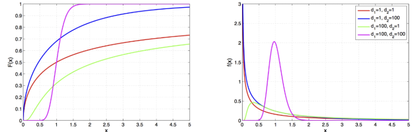

Свойства и моменты:

Его форма определяется двумя параметрами — степенями свободы числителя и знаменателя.

$$E[X] = \frac{d_2}{d_2 - 2}, \quad \text{при } d_2 > 2$$

**Важное условие:** Если $d_2 \leq 2$, математическое ожидание не определено (бесконечно).

$$\text{Var}(X) = \frac{2d_2^2(d_1 + d_2 - 2)}{d_1(d_2 - 2)^2(d_2 - 4)}, \quad \text{при } d_2 > 4$$

**Важное условие:** Дисперсия существует только в том случае, если число степеней свободы знаменателя строго больше $4$. Если $d_2 \leq 4$, дисперсия не определена.

Пример: возникает в дисперсионном и регрессионном анализе

---

## 3.Нормальное распределение: стандартное и с параметрами μ, σ. Приведение к стандартному виду. Определения, графики, свойства, примеры. Правило трёх сигм. Теорема Крамера. ЦПТ.

$$X \in \mathbb{R} \sim N\left(\mu, \sigma^2\right), \quad \sigma^2 > 0$$

$$F(x) = \Phi \left( \frac{x - \mu}{\sigma} \right)$$

$$f(x) = \frac{1}{\sigma} \phi \left( \frac{x - \mu}{\sigma} \right)$$

$$\Phi (x) = \frac{1}{\sqrt{2\pi}} \int_{-\infty}^{x} e^{-\frac{t^2}{2}} dt$$

$$\phi (x) = \frac{1}{\sqrt{2\pi}} e^{-\frac{x^2}{2}}$$

Стандартное нормальное распределение - Это частный случай, когда $\mu = 0$, а $\sigma = 1$. Обозначается как $Z \sim N(0, 1)$. Его плотность упрощается до:

$$\phi(z) = \frac{1}{\sqrt{2\pi}} e^{-\frac{z^2}{2}}$$

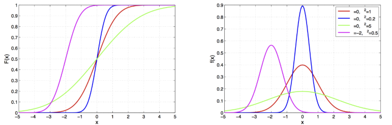

Свойства и моменты:

**предельное распределение суммы слабо взаимозависимых случайных величин**

$\mathbb{E} X = \text{med } X = \text{mode } X = \mu$, $\mathbb{D} X = \sigma^2$, все моменты более высокого порядка нулевые

**Сумма нормальных распределений(или линейная комбинация):**

**пусть** $X_1, \ldots, X_n$ **независимы,** $X_i \sim N\left(\mu_i, \sigma_i^2\right)$, **тогда** $\forall a_1, \ldots, a_n$  

$$\sum_{i=1}^n a_i X_i \sim N \left( \sum_{i=1}^n a_i \mu_i, \sum_{i=1}^n a_i^2 \sigma_i^2 \right)$$

Пример: погрешность измерения

### Приведение к стандартному виду (Z-преобразование)

Любую нормальную величину $X$ можно превратить в стандартную $Z$. Это нужно для использования статистических таблиц:

$$Z = \frac{X - \mu}{\sigma}$$

Это действие называют **центрированием** (вычитаем $\mu$) и **нормированием** (делим на $\sigma$).

### **Правило трёх сигм** — это эмпирическое правило, которое позволяет быстро оценить разброс данных в нормальном распределении. Оно гласит, что практически все значения (99.7%) нормально распределённой случайной величины лежат в интервале $\pm 3\sigma$ от её среднего значения $\mu$.

### Суть правила

Для нормального распределения вероятность того, что случайная величина отклонится от своего математического ожидания, распределяется следующим образом:

1. **$1\sigma$ (Правило 68%):** Около 68.27% данных лежат в пределах одного стандартного отклонения от среднего $[\mu - \sigma; \mu + \sigma]$.  
2. **$2\sigma$ (Правило 95%):** Около 95.45% данных лежат в пределах двух стандартных отклонений от среднего $[\mu - 2\sigma; \mu + 2\sigma]$.  
3. **$3\sigma$ (Правило 99.7%):** Около 99.73% данных лежат в пределах трёх стандартных отклонений от среднего $[\mu - 3\sigma; \mu + 3\sigma]$.

Это правило — главный инструмент для поиска аномалий (выбросов). Если какое-то значение выходит за пределы трёх сигм, оно считается крайне маловероятным (вероятность всего 0.27%) и, скорее всего, вызвано какой-то ошибкой или экстраординарным фактором.

### Теорема Крамера

Пусть случайная величина $\xi$ имеет нормальное распределение и представима в виде суммы двух независимых случайных величин  
$$\xi = \xi_1 + \xi_2.$$
Тогда $\xi_1$ и $\xi_2$ также нормально распределены.

### ЦПТ

**центральная предельная теорема:** пусть $X_1, \ldots, X_n$ **i.i.d. с $\mathbb{E}X$ и $\mathbb{D}X < \infty$, тогда**

$$\frac{1}{n} \sum_{i=1}^n X_i \sim N \left( \mathbb{E} X, \frac{\mathbb{D} X}{n} \right)$$

Если вы возьмете большое количество независимых случайных величин с любым распределением (даже очень странным), их сумма или среднее значение будет стремиться к нормальному распределению при увеличении числа слагаемых.

---

## 4.Генеральная совокупность. Выборка. Эмпирическая функция распределения. Теорема Гливенко — Кантелли. Гистограмма частот. Статистика (функция выборки). Статистики, используемые для оценки характеристик распределений. выборочные моменты, порядковая статистика, интерквартильный размах. Боксплот (ящик с усами).

**Генеральная совокупность** — множество объектов, свойства которых подлежат изучению в рассматриваемой задаче.

**Выборка** — конечное множество объектов, отобранных из генеральной совокупности для проведения измерений.

$$X^n = (X_1, \ldots, X_n).$$

$n$ — объём выборки.

$X^n$ — **простая выборка**, если $X_1, \ldots, X_n$ — независимые одинаково распределённые случайные величины (i.i.d.).

Основная задача статистики — описание $F_X(x)$ по реализации выборки.

**Функция распределения**

$$F_n(x) = \frac{1}{n} \sum_{i=1}^n \mathbb{I}[X_i \leq x]$$ — **эмпирическая функция распределения.**

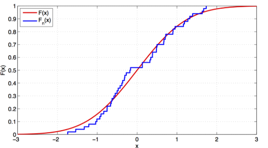

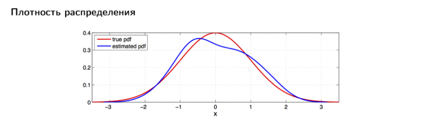

**Теорема Гливе́нко — Канте́лли** в математической статистике уточняет результат о сходимости выборочной функции распределения к её теоретическому аналогу.

Пусть $X_1, \ldots, X_n, \ldots$ — бесконечная выборка из распределения, задаваемого функцией распределения $F$.

Пусть $\hat{F}$ — выборочная функция распределения, построенная на первых $n$ элементах выборки. Тогда

$$\lim_{n \to \infty} \sup_{x \in \mathbb{R}} |\hat{F}(x) - F(x)| = 0$$

почти наверное,

где символ $\sup$ обозначает точную верхнюю грань.

Гистограмма частот — это ступенчатый график в виде прямоугольников, показывающий распределение числовых данных: ось X делит данные на интервалы (классы), а высота каждого столбика отражает частоту (количество) значений, попавших в этот интервал.

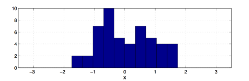

**Статистика $T(X^n)$** — любая измеримая функция выборки. Например:

Выборочное среднее: 

$$\bar{X} = \frac{1}{n} \sum_{i=1}^{n} X_i$$

Выборочная дисперсия: 

$$S^2 = \frac{1}{n-1} \sum_{i=1}^{n} (X_i - \bar{X})^2$$

Вариационный ряд - $X_{(1)} \leq X_{(2)} \leq \ldots \leq X_{(n)}$ , где

ранг элемента выборки - $X_i$: $\text{rank}(X_i) = r \quad \text{такой, что } X_i = X_{(r)}$

$k$-я порядковая статистика: $X_{(k)}$

Выборочный $\alpha$-квантиль: $X_{(\lfloor \alpha n \rfloor)}$

Выборочная медиана:  

  $$m = 
  \begin{cases} 
    X_{(k+1)}, & \text{если } n = 2k + 1, \\
    \frac{X_{(k)} + X_{(k+1)}}{2}, & \text{если } n = 2k.
  \end{cases}$$

Выборочный интерквартильный размах: 

$$IQR_n = X_{(\lfloor 0.75n \rfloor)} - X_{(\lfloor 0.25n \rfloor)}$$

Выборочный коэффициент асимметрии: 

$$g_1 = \sqrt{n} \frac{\sum_{i=1}^{n} (X_i - \bar{X})^3}{\left( \sum_{i=1}^{n} (X_i - \bar{X})^2 \right)^{3/2}}$$

Выборочный коэффициент эксцесса: 

$$g_2 = \frac{n \sum_{i=1}^{n} (X_i - \bar{X})^4}{\left( \sum_{i=1}^{n} (X_i - \bar{X})^2 \right)^2} - 3$$

Боксплот (или ящик с усами) — это графическое представление, используемое для визуализации распределения данных через показатели центра (медиана), разброса (квартили) и наличие выбросов. Внешне боксплот представляет собой прямоугольник (ящик), высота которого показывает интерквартильный размах (разницу между верхним и нижним квартилями), внутри которого находится линия, отображающая медиану. От ящика выходят "усы", которые простираются до минимального и максимального наблюдаемого значения, за исключением выбросов.

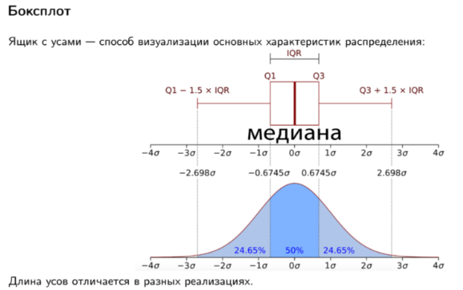

---

## 5.Точечные оценки параметров распределения, свойства. Метод моментов. Метод максимального правдоподобия, свойства.

Пусть распределение генеральной совокупности параметрическое:

$$F(x) = F(x, \theta).$$

Статистика $\hat{\theta}_n = \hat{\theta}(X^n)$ — **точечная оценка параметра $\theta$.**

Какая оценка лучше?

**Состоятельность:**

$$\lim_{n \to \infty} \hat{\theta}_n = \theta.$$

**Несмещённость:**

$$\mathbb{E}\hat{\theta}_n = \theta.$$

**Асимптотическая несмещённость:**

$$\lim_{n \to \infty} \mathbb{E}\hat{\theta}_n = \theta.$$

**Оптимальность:**

$$\mathbb{D}\hat{\theta}_n = \min_{\hat{\theta}_1 \in \mathcal{U}} \mathbb{D}\hat{\theta}_1,$$

где $\mathcal{U}$ — класс несмещённых оценок.

**Робастность:**

устойчивость $\hat{\theta}_n$ относительно

- отклонений истинного распределения $X$ от модельного семейства

- выбросов, содержащихся в выборке

### Метод моментов

**Оценка одного параметра.** Пусть известен вид плотности распределения $f(x, \theta)$, зависящей от одного параметра $\theta$, но не известно значение этого параметра.

Для нахождения его оценки достаточно составить одно уравнение, например, для начальных моментов первого порядка:  
$$\bar{x}_B = M(X).$$

Так как математическое ожидание признака генеральной совокупности

$$M(X) = \int_{-\infty}^{\infty} x \cdot f(x, \theta) dx = \varphi(\theta)$$

зависит от неизвестного параметра $\theta$, а выборочное среднее

$$\bar{x}_B = \frac{x_1 + x_2 + \cdots + x_n}{n}$$

зависит от реализации выборки

$$x_1, x_2, \ldots, x_n,$$

то после решения уравнения

$$\varphi(\theta) = \frac{x_1 + x_2 + \cdots + x_n}{n}$$

мы получаем

$$\theta^* = \psi(x_1, x_2, \ldots, x_n)$$

— оценку неизвестного параметра как функцию значений конкретной выборки.

### Метод максимального правдоподобия

**Дискретные случайные величины.** Пусть $X$ – дискретная случайная величина, для которой в результате опыта получена выборка значений $x_1, x_2, \ldots, x_n$. Вид закона распределения известен; закон содержит неизвестный параметр $\theta$, для которого требуется найти точечную оценку на основании данных выборки.

Обозначим вероятность $P(X = x_i) = p(x_i; \theta),\; i = 1, 2, \ldots, n$.

**Функцией правдоподобия** дискретной случайной величины $X$ называют функцию аргумента $\theta$ и данной выборки $x_1, x_2, \ldots, x_n$:

$$L(x_1, x_2, \ldots, x_n; \theta) = p(x_1; \theta) \cdot p(x_2; \theta) \cdot \ldots \cdot p(x_n; \theta).$$

В качестве точечной оценки параметра $\theta$ принимается значение $\theta^* = \theta^*(x_1, x_2, \ldots, x_n)$, при котором функция правдоподобия достигает наибольшего значения. Полученную оценку называют **оценкой максимального правдоподобия**.

Так как функции $L$ и $\ln L$ достигают максимума при одном и том же значении $\theta$, при практических вычислениях чаще используют вторую функцию, называемую **логарифмической функцией правдоподобия**:

$$\ln L(x_1, x_2, \ldots, x_n; \theta) = \ln p(x_1; \theta) + \ln p(x_2; \theta) + \ldots + \ln p(x_n; \theta).$$

Свойства:

- **состоятельность:**

$$\lim_{n \to \infty} \hat{\theta}_{MLE} = \theta$$

- **асимптотическая нормальность:** при $n \to \infty$

$$\hat{\theta}_{MLE} \sim N \left( \theta, I^{-1}(\theta) \right)$$

- **эффективность:** ОМП имеют наименьшую дисперсию среди всех состоятельных оценок  
- **инвариантность:**

$$g \left( \hat{\theta}_{MLE} \right) \text{ — ОМП-оценка для } g(\theta)$$

---

## 6.Квантили и построение доверительных интервалов. Интервальные оценки с помощью квантилей: для нормального распределения, для ненормальных распределений. Отличие z-доверительного интревала. Бутстреп-распределение, базовый бутстреп, свойства.

Квантили — это значения, разделяющие упорядоченный набор данных на равные доли. Например, медиана является вторым квартилем (т.е. 50%-квантилью).

Квантиль порядка $\alpha \in (0, 1)$:

$$X_\alpha : P(X \leq X_\alpha) \geq \alpha, \, P(X \geq X_\alpha) \geq 1 - \alpha$$

Интервальная оценка неизвестного параметра $\Theta$ – случайные функции $\Theta_1^* (X_1, X_2, \ldots, X_n)$ и $\Theta_2^* (X_1, X_2, \ldots, X_n)$ такие, что

$$P (\Theta_1^* < \Theta < \Theta_2^*) = \gamma = 1 - \alpha,$$  

т.е. интервал $(\Theta\_1^{\*}, \Theta\_2^{\*})$ заключает в себе (покрывает) неизвестный параметр $\Theta$ с вероятностью $\gamma$.  

Сам интервал носит название **доверительного интервала**, величина $\gamma = 1 - \alpha$ называется **доверительной вероятностью** оценки (надёжностью, коэффициентом доверия), числа $\Theta_1^{\*}$ и $\Theta_2^{\*}$ – **доверительными границами**, $\alpha$ – **уровнем значимости**.

Непараметрический доверительный интервал для медианы непрерывного распределения.

$$X^n = (X_1, \ldots, X_n), \quad X \sim F(x) \Rightarrow$$

$$\mathbf{P}(X_{(r)} \leq \text{med}\,X) = \sum_{i=r+1}^n C_n^i \frac{1}{2^i} \cdot \frac{1}{2^{n-i}},$$

$$\mathbf{P}(\text{med}\,X \in [X_{(r)}, X_{(n-r+1)}]) = \frac{1}{2^n} \sum_{i=r}^{n-r+1} C_n^i.$$

При $n > 10$ применима нормальная аппроксимация:

$$\mathbf{P}\left(\text{med}\,X \in \left[ X_{\left(\frac{n-\sqrt{n}z_{1-\alpha/2}}{2}\right)} ,\; X_{\left(\frac{n+\sqrt{n}z_{1-\alpha/2}}{2}\right)} \right] \right) \approx 1 - \alpha.$$

Аналогично строится непараметрический доверительный интервал для любого квантиля $X_\alpha, \alpha \in (0, 1)$:

$$\mathbf{P}(X_\alpha \in [X_{(l)}, X_{(u)}]) = \sum_{i=l}^u C_n^i \alpha^i (1 - \alpha)^{n-i}.$$

**Параметрический метод**

Параметрический метод используется, когда предполагается известная форма распределения данных и известные параметры этого распределения. Например, если данные приближаются нормальным распределением, то используются формулы для построения доверительных интервалов на основе стандартного нормального распределения или распределения Стьюдента в зависимости от известности или неизвестности дисперсии.

**Пример:**

**Доверительный интервал для среднего с известной дисперсией:**

$$\left[ \bar{X} - z_{\alpha/2} \frac{\sigma}{\sqrt{n}},\; \bar{X} + z_{\alpha/2} \frac{\sigma}{\sqrt{n}} \right]$$

где $\bar{X}$ — выборочное среднее, $\sigma$ — известное стандартное отклонение, $z_{\alpha/2}$ — квантиль стандартного нормального распределения.

**Наивный метод**

Наивный метод _(или метод “по-быстрому”)_ используется без предположений о распределении данных или их параметрах. Он основывается на статистической интуиции и может быть применён в ситуациях, когда нет точной информации о распределении или мало данных для более сложных методов.

**Пример:**

Доверительный интервал для доли:  

$$\left[ \hat{p} - z_{\alpha/2} \sqrt{\frac{\hat{p}(1 - \hat{p})}{n}},\; \hat{p} + z_{\alpha/2} \sqrt{\frac{\hat{p}(1 - \hat{p})}{n}} \right]$$

где $\hat{p}$ — выборочная доля, $z_{\alpha/2}$ — квантиль стандартного нормального распределения.

**Бутстрэп**

**Бутстрэп** — это метод, который позволяет оценить распределение выборочной статистики путем повторного выбора элементов из исходной выборки с возвращением. Этот метод особенно полезен, когда данные сложно распределены или необходимо оценить нестандартные статистики.

Процесс бутстрэпа:

- Сгенерировать много подвыборок (бутстреп-выборок) из исходной выборки.
- Для каждой бутстреп-выборки вычислить интересующую статистику (например, среднее, медиану, долю и т.д.).
- Построить распределение статистики на основе бутстреп-выборок и вычислить доверительный интервал, например, через квантили полученного распределения.

**Бутстреп-распределение**

$X_1^{\*}, \ldots, X_n^{\*}$ — бутстреп-псевдовыборка объёма $n$ из $X^n$,

$\theta_1^{\*}, \ldots, \theta_B^{\*}$ — значения статистики на них,

$\hat{F}_\theta^{\*}(x)$ — бутстреп-распределение $\theta^{\*}$, эмпирическая функция распределения, построенная по значениям статистики на псевдовыборках.

Возьмём выборочные квантили бутстреп-распределения:

$$P\left(\left(F_{\theta_n}^{boot}\right)^{-1} \left(\frac{\alpha}{2}\right)\leqslant\theta\leqslant\left(F_{\theta_n}^{boot} \right)^{-1}\left(1-\frac{\alpha}{2}\right)\right)\approx 1-\alpha.$$

Это **базовый бутстреп**.

**Свойства бутстрепа**

- асимптотическая состоятельность  
- простота использования даже для самых сложных статистик  
- плохо работает для статистик, значение которых зависит от небольшого числа элементов выборки

**Интервальные оценки с помощью квантилей** используются для оценки диапазона значений параметра с заданной вероятностью.

**Интервальные оценки**

Доверительный интервал: $$P(\theta \in [C_L, C_U]) \geq 1 - \alpha,$$

$1 - \alpha$ — уровень доверия,  
$C_L, C_U$ — нижний и верхний доверительные пределы.

**Неверная интерпретация:** неизвестный параметр лежит в пределах построенного доверительного интервала с вероятностью $1 - \alpha$.

**Верная интерпретация:** при бесконечном повторении процедуры построения доверительного интервала на аналогичных выборках в $100(1 - \alpha)\%$ случаев он будет содержать истинное значение $\theta$.

**Для нормального распределения**

$$X \sim N\left(\mu, \sigma^2\right), \quad X^n = (X_1, \ldots, X_n),$$

$\bar{X}_n$ — оценка $\mathbb{E}X = \mu$,

$$\bar{X}_n \sim N\left(\mu, \frac{\sigma^2}{n}\right) \Rightarrow P\left(\mu - z_{1-\frac{\alpha}{2}} \frac{\sigma}{\sqrt{n}} \leq \bar{X}_n \leq \mu + z_{1-\frac{\alpha}{2}} \frac{\sigma}{\sqrt{n}}\right) = 1 - \alpha \Rightarrow$$

доверительный интервал для $\mu$:

$$P\left(\bar{X}_n - z_{1-\frac{\alpha}{2}} \frac{\sigma}{\sqrt{n}} \leq \mu \leq \bar{X}_n + z_{1-\frac{\alpha}{2}} \frac{\sigma}{\sqrt{n}}\right) = 1 - \alpha,$$

$z_{1-\frac{\alpha}{2}}$ — квантиль стандартного нормального распределения.

**Для ненормальных распределений**

ЦПТ: если $X^n$ — выборка из $F(x)$, $F(x)$ не слишком скошена и $n > 30$, то

$$\bar{X}_n \approx N \left( \mathbb{E}X, \frac{\mathbb{D}X}{n} \right) \Rightarrow$$

доверительный интервал для $\mathbb{E}X$:

$$P \left( \bar{X}_n - z_{1-\frac{\alpha}{2}} \sqrt{\frac{\mathbb{D}X}{n}} \leq \mathbb{E}X \leq \bar{X}_n + z_{1-\frac{\alpha}{2}} \sqrt{\frac{\mathbb{D}X}{n}} \right) \approx 1 - \alpha.$$

Если дисперсия неизвестна:

$$P \left( \bar{X}_n - t_{n-1,1-\frac{\alpha}{2}} \frac{S_n}{\sqrt{n}} \leq \mathbb{E}X \leq \bar{X}_n + t_{n-1,1-\frac{\alpha}{2}} \frac{S_n}{\sqrt{n}} \right) \approx 1 - \alpha,$$

$t_{n-1,1-\frac{\alpha}{2}}$ — квантиль распределения Стьюдента с $n - 1$ степенью свободы.

**Z-доверительный интервал** используется, когда **известно стандартное отклонение генеральной совокупности** ($\sigma$) и/или **размер выборки большой** ($n > 30$). Он строится с помощью **Z-распределения (стандартного нормального распределения)**, в отличие от **t-интервала**, который применяется при неизвестном $\sigma$ и малых выборках, используя распределение Стьюдента, и даёт более широкие (менее точные) интервалы для малых данных.

Основное отличие Z-интервала — его основа на Z-статистиках (например, $1.96$ для $95\%$ ДИ) и применение при «идеальных» условиях, в то время как t-интервал более гибок для реальных, ограниченных данных.

---

## 7.Методика проверка параметрических гипотез с помощью: 1) p-value (достигаемый уровень значимости); 2) значения критерия; 3) доверительного интервала. Виды альтернатив, соответствующий p-value в каждом случае. Примеры гипотез.

**Общая схема проверки статистических гипотез включает следующие шаги:**

- Формулировка основной (нулевой) гипотезы $H_{0}$ (например, о равенстве параметра заданному значению) и альтернативной (конкурирующей) гипотезы $H_{1}$ (односторонняя или двусторонняя).
- Выбор статистического критерия — случайной величины, распределение которой известно (точное или приближенное) при условии истинности $H_{0}$
- Определение правил проверки (выбор уровня значимости $\alpha$, объема выборки)
- Расчет значения статистики по выборочным данным и принятие решения (отклонить или принять $H_{0}$) одним из трех способов

**1) Проверка с помощью p-value (достигаемый уровень значимости)**

**Суть метода:**

- Вычисляется p-value ($p$) — вероятность при справедливости нулевой гипотезы $H_{0}$ получить значение статистики критерия, равное наблюдаемому ($t$) или еще более экстремальному.
- Это вероятность $P(T \ge t | H_{0})$.

  Правило принятия решения:

  - Если $p(x^n) \le \alpha$ (уровень значимости), то гипотеза $H_{0}$ отвергается.
  - Если $p > \alpha$, гипотеза $H_{0}$ не отвергается.
 
**Пример:**
В задаче о среднем весе землероек ($H_0 : \mu = 90\, \text{г}$) при $\alpha = 0.05$ и $p = 0.0384$ гипотеза отвергается в пользу односторонней альтернативы $H_1 : \mu > 90\, \text{г}$.
 
**2) Проверка с помощью значения критерия (статистики критерия)**

**Суть метода:**

- До сбора данных выбирается уровень значимости $\alpha$
- Определяется критическая область ($S$) — множество значений критерия, при которых $H_{0}$ отклоняется, и область принятия гипотезы ($\overline{S}$)
- Границами этих областей служат критические точки (квантили распределения), которые находятся по таблицам (например, $z_{\alpha}$, $t_{crit}$, $F_{crit}$)

  Правило принятия решения:
  
  - Рассчитывается наблюдаемое значение критерия $\Theta_{набл}$ (или $Z_{obs}, t_{obs}$) по выборке
  - Если наблюдаемое значение попадает в критическую область ($\Theta_{набл} \in S$), гипотеза $H_{0}$ отклоняется
  - Если значение попадает в область принятия ($\Theta_{набл} \in \overline{S}$), гипотеза $H_{0}$ принимается (не отклоняется)

**Пример:**
Для z-критерия при $\alpha = 0.05$ и двусторонней альтернативе критические точки $z_{\text{кр}} = \pm 1.96$. Если $z_{\text{набл}} = 2.5 > 1.96$, то $H_0$ отвергается

**3) Проверка с помощью доверительного интервала**

**Суть метода:**

- На основе критического значения статистики (например, $t$) можно построить доверительный интервал для параметра популяции (например, для среднего $\mu$)
- Центром интервала является выборочное среднее

  Правило принятия решения:
  
  - Если значение параметра, предполагаемое в нулевой гипотезе (например, $\mu_0$), не попадает в построенный доверительный интервал (например, 95%-й), то гипотеза $H_{0}$ отвергается1919
  - Если значение попадает в интервал, гипотеза не отвергается

**Пример:**
Для среднего веса пушистых упаковок ($H_0 : \mu = 4\, \text{г}$) 95% доверительный интервал $[3.95, 5.25]$ содержит $4$ и поэтому $H_0$ не отвергается при двусторонней альтернативе

Вид альтернативы определяет способ расчёта p-value и выбор критической области.

**Типы альтернатив и расчёт p-value (на примере Z-критерия):**

1. Двусторонняя альтернатива (Two-tailed hypothesis)

  - **Формулировка:** $H_1 : \mu \neq \mu_0$ (параметр не равен заданному числу).  
    *Суть:* Нас интересуют отклонения в любую сторону (больше или меньше).
  
  - **P-value:** $p(Z) = 2(1 - F_{N(0,1)}(|Z|))$ — улавливается площадь «хвоста» распределения.  
  - **Критическая область:** Две области по краям распределения, границы определяются как $\alpha / 2$.

2. Односторонняя альтернатива (One-tailed hypothesis) — Правосторонняя

  - **Формулировка:** $H_1 : \mu > \mu_0$ (параметр больше заданного числа).  
  - **P-value:** $p(Z) = 1 - F_{N(0,1)}(Z)$ — площадь под кривой справа от наблюдаемого значения.  
  - **Критическая область:** Расположена справа, определяется из условия $P(\Theta > \Theta_2) = \alpha$.

3. Односторонняя альтернатива (One-tailed hypothesis) — Левосторонняя

  - **Формулировка:** $H_1 : \mu < \mu_0$ (параметр меньше заданного числа).  
  - **P-value:** $p(Z) = F_{N(0,1)}(Z)$ — площадь под кривой слева от наблюдаемого значения.  
  - **Критическая область:** Расположена слева, определяется из условия $P(\Theta < \Theta_1) = \alpha$.

Примеры гипотез:
1. Двусторонняя: Отличается ли средняя масса землероек в исследовании от табличной (90 г)? $H_{0}: \mu = 90$; $H_{1}: \mu \ne 90$
2. Односторонняя (правосторонняя): Весят ли землеройки больше 90 г? $H_{0}: \mu \le 90$; $H_{1}: \mu > 90$
3. О суде присяжных (сравнение долей): Была ли процедура отбора беспристрастной (доля женщин 0.5)? $H_{0}: p = 0.5$; $H_{1}: p < 0.5$ (предпочтение отдавалось мужчинам)

---

## 8.Проверка гипотез о доле признака (z-критерий для доли). Биномиальный критерий. Z-критерий для разности двух долей (незавиимые и связанные выборки).

**Z-критерий для одной доли (Сравнение с нормативом)**

Применяется, когда нужно проверить, равна ли доля признака $p$ в генеральной совокупности определенному значению $a$ (или $p_0$).

**Условия:** Выборка достаточно велика ($n$), чтобы использовать нормальное приближение биномиального закона.

**Гипотезы:** $H_{0}: p = p_0$ (или $p=a$) против альтернатив $p \ne p_0$, $p > p_0$ или $p < p_0$.

**Статистика критерия:**

$$Z = \frac{\hat{p} - p_0}{\sqrt{\frac{p_0(1-p_0)}{n}}}$$

Где $\hat{p} = m/n$ — выборочная доля.

**Распределение:** При $H_0$ статистика $Z \sim N(0,1)$.

**Пример:**
Проверка гипотезы $H_0 : p = 0.1$ при $n = 100$, $\hat{p} = 0.15$.
При $H_1 : p > 0.1$ и $\alpha = 0.05$ находим $z_{\text{набл}} = 1.67$, критическое значение $z_{\text{кр}} = 1.645$. Так как $1.67 > 1.645$, $H_0$ отвергается

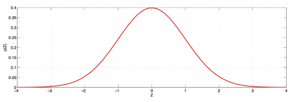

**Биномиальный критерий (Точный критерий)**

**Условия:** Малая выборка или необходимость точного решения.

**Статистика:** $T = \sum X_i$ (количество успехов $m$).

**Распределение:** При $H_0$ статистика $T \sim Bin(n, p_0)$.

**Достигаемый уровень значимости:**

$$p(T) =
\begin{cases} 
1 - F_{Bin(n, p_0)}(T - 1), & H_1 : p > p_0, \\
F_{Bin(n, p_0)}(T), & H_1 : p < p_0, \\
\text{через бета-распределение}, & H_1 : p \neq p_0.
\end{cases}$$

**Особенность:** Из-за дискретности распределения нельзя добиться, чтобы вероятность ошибки 1-го рода была ровно $\alpha$46. Доверительный интервал Клоппера-Пирсона основан на этом критерии.

**Пример:**
Проверка гипотезы $H_0 : p = 0.05$ при $n = 20$, $m = 2$.
Для $H_1 : p > 0.05$: $p = P(T \ge 2) = 0.2642$ (биномиальный расчёт)

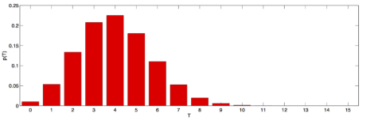

**Z-критерий для разности двух долей (Независимые выборки)**

Сравниваются частоты появления признака в двух независимых совокупностях ($n_1$ и $n_2$).

**Условия:** Большие выборки ($n > 30$), распределение частот близко к нормальному.

**Выборки:** $X_{n_1}^1 \sim Ber(p_1)$, $X_{n_2}^2 \sim Ber(p_2)$.

$H_0 : p_1 = p_2$, $H_1 : p_1 \neq p_2$ (или $>$, $<$).

**Статистика:**

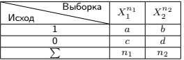

$$Z = \frac{\hat{p}_1 - \hat{p}_2}{\sqrt{P(1-P)\left(\frac{1}{n_1} + \frac{1}{n_2}\right)}}, \quad \text{где } P = \frac{\hat{p}_1 n_1 + \hat{p}_2 n_2}{n_1 + n_2} , \quad \hat{p}_1 = \frac{a}{n_1}, \quad \hat{p}_2 = \frac{b}{n_2}$$

**Распределение:** $N(0, 1)$.

**Пример:**
Сравнение долей брака в двух партиях: $n_1 = 100$, $m_1 = 4$; $n_2 = 500$, $m_2 = 12$.

$$\hat{p}_1 = 0.04,\; \hat{p}_2 = 0.024,\; P = 0.027.$$

$$z_{\text{набл}} = 1.06,\; \text{при } \alpha = 0.05 \text{ критические значения } \pm 1.96.$$

$H_0$ не отвергается

**Z-критерий для разности двух долей (связанные выборки)**

**Условия:** Используется, когда одни и те же объекты проверяются дважды (например, "до" и "после") или выборки сопряжены. Данные представляются в таблице $2 \times 2$, где нас интересуют ячейки, в которых результат изменился (несовпадающие пары).

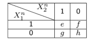

**Гипотеза:** $H_{0}: p_1 = p_2$.

**Статистика:**

$$Z(X_1^n, X_2^n) = \frac{\hat{p}_1 - \hat{p}_2}{\sqrt{\frac{f + g}{n^2} - \frac{(f - g)^2}{n^3}}} = \frac{f - g}{\sqrt{f + g - \frac{(f - g)^2}{n}}}$$

**Распределение:** $N(0,1)$.

**Пример:**
Оценка изменения рейтинга премьер-министра в двух опросах –  
$e = 794$, $f = 150$, $g = 86$, $h = 570$, $n = 1600$.  
$z_{набл} = 4.47$, $p\text{-value} \approx 2.8 \times 10^{-6}$, $H_0$ отвергается

---

## 9.Сравнение различий в средних: z-критерий; t-критерии Стьюдента для независимых и связанных выборок; случаи, если дисперсии выборок не равны. Формирование выборок (условия применимости) для параметрических критериев. Примеры.

Z-критерий (z-test) используется для сравнения среднего значения выборки с известным средним значением популяции, когда дисперсия популяции известна. Это одновыборочный критерий, который проверяет, отличается ли среднее в выборке от заданного числа.

**Статистика:**

$$z = \frac{\bar{X} - \mu}{\sigma_{\bar{X}}}$$

где $\bar{X}$ — среднее выборки, $\mu$ — среднее популяции, $\sigma_{\bar{X}} = \frac{\sigma}{\sqrt{n}}$ — стандартная ошибка среднего (SE), $\sigma$ — стандартное отклонение популяции, n — размер выборки.

**Z-критерий** предполагает нормальное распределение в популяции и известную дисперсию. Он более "строгий", чем t-критерий, так как не учитывает оценку дисперсии из выборки, что делает критические значения меньше.

**Пример:**

Проверка гипотезы о том, отличается ли средняя масса землероек в исследовании от 90 г при известном $\sigma = 20$ и $n = 25$.

$$H_0 : \mu = 90, \quad H_1 : \mu \neq 90$$

Расчёт критических значений $z_{кр} = \pm 1.96$ при $\alpha = 0.05$. Если $z_{набл}$ попадает в критическую область, $H_0$ отвергается.

**t-критерий Стьюдента для независимых выборок** — двухвыборочный критерий для сравнения средних двух независимых групп, когда дисперсия популяции неизвестна. Он проверяет, получены ли выборки из одной популяции или равны ли их средние. Формулировка гипотез: H₀: $\mu_1 = \mu_2$ (или $\mu_1 - \mu_2 = 0$), H₁: $\mu_1 \neq \mu_2$ (двусторонняя) или односторонняя (например, $\mu_1 > \mu_2$).

**Статистика:**

$$t = \frac{\overline{X}_1 - \overline{X}_2}{S_{\overline{X}_1 - \overline{X}_2}}, \quad S_{\overline{X}_1 - \overline{X}_2} = \sqrt{\frac{s_{pooled}^2}{n_1} + \frac{s_{pooled}^2}{n_2}}$$

где $s_{pooled}^2 = \frac{(n_1 - 1)s_1^2 + (n_2 - 1)s_2^2}{n_1 + n_2 - 2}$ — объединённая дисперсия. Степени свободы: df = n₁ + n₂ - 2.

**Условия применения:**

- Выборки независимы, нормальное распределение в каждой.
- Дисперсии равны (проверяется F-критерием).
- Размер выборок: n ≥ 10 в каждой, предпочтительно ≥30.
- Размеры выборок могут отличаться.

**Процесс:** 

Сначала проверить нормальность и равенство дисперсий (F-test: если p ≤ 0.05, дисперсии не равны — использовать вариант Уэлча). Затем рассчитать t, сравнить с критическим (из таблиц t-распределения). Если |t| > критическое, отвергнуть H₀. Зависит от различий средних, изменчивости и размеров выборок.

**Пример:**

Сравнение массы тигров-самцов и самок.

$$H_0 : \mu_1 = \mu_2, \quad H_1 : \mu_1 \neq \mu_2$$

Проверка равенства дисперсий с помощью F-критерия, затем расчёт t-статистики.

**t-критерий Стьюдента для связанных выборок** используется для сравнения средних в двух связанных группах (например, до и после вмешательства на одних и тех же объектах). Это эквивалентно одновыборочному t-тесту на разностях (D = значение после - значение до). Гипотезы: H₀: $\mu_D = 0$ (нет изменений), H₁: $\mu_D \neq 0$ (двусторонняя) или односторонняя.

**Статистика:**

 $$  t = \frac{\bar{D}}{s_{\bar{D}}}  $$
 
 где $\bar{D}$ — средняя разность, $s_{\bar{D}} = \frac{s_D}{\sqrt{n}}$, s_D — стандартное отклонение разностей, df = n - 1 (n — число пар).

**Условия:** 
Выборки связаны (одни и те же объекты), нормальное распределение разностей, нет требования равенства дисперсий исходных выборок (поскольку фокус на разностях). Размер: n ≥ 10, лучше ≥30.

**Преимущество:** 
Устраняет внутригрупповую изменчивость, повышая мощность по сравнению с независимыми выборками. Можно использовать тест для независимых, но рискуете не увидеть различий при большой изменчивости.

**Пример:**

Изменение массы тигров-самцов после прихода нового служителя.

$$H_0 : \mu_D = 0, \quad H_1 : \mu_D \neq 0$$

Расчёт среднего различия $D$ и t-статистики.

**Случаи, если дисперсии выборок не равны**

Если дисперсии в двух независимых выборках значительно различаются (гетерогенность), стандартный t-критерий может давать некорректные результаты.

**Решение: подход Уэлча (Welch's t-test)**

Используется модифицированная формула стандартной ошибки и скорректированные степени свободы.

Перед проведением t-теста необходимо проверить равенство дисперсий с помощью F-теста (критерий Фишера). Если $p \leq 0.05$, дисперсии считаются неравными, и применяется критерий Уэлча.

$$t = \frac{\bar{X}_1 - \bar{X}_2}{\sqrt{\frac{s_1^2}{n_1} + \frac{s_2^2}{n_2}}}$$

Для связанных выборок проблема дисперсий не актуальна, так как тест на разностях. Несоблюдение равенства дисперсий допустимо, если распределения нормальные и размеры выборок отличаются не более чем на 10%. Если нарушение сильное, переходите к непараметрическим альтернативам (например, U-критерий Манна-Уитни).

**Пример:**

В анализе массы тигров-самцов и самок сначала выполнен F-тест, который показал значимое различие дисперсий ($p = 2.98 \times 10^{-5}$), поэтому использован критерий Уэлча.

**Формирование выборок (условия применимости) для параметрических критериев**

Параметрические критерии (z, t, F и т.д.) предполагают определенные условия для выборок, чтобы результаты были надежными. Основные требования:

**1. Случайность измерений:**
Каждый элемент популяции должен иметь равную вероятность попасть в выборку.
Пример: случайное распределение животных в контрольную и экспериментальную группы.

**2. Независимость измерений:**
Отсутствие корреляции между наблюдениями (например, во времени или пространстве).
Пример: измерения массы разных особей, а не повторные измерения одной особи.

**3. Минимизация посторонней дисперсии:** 
Выровнять выборку так, чтобы влияние посторонних факторов было сведено на нет, либо в дальнейшем учитывать действие этих факторов. 
Пример: анализировать изменчивость размеров тела в разных популяциях лучше на особях одного пола и возраста.

**4. Нормальность распределения:**
Данные должны быть получены из популяции с нормальным распределением. Проверяется тестами:
- Shapiro–Wilk (предпочтительный)
- Lilliefors
- Kolmogorov–Smirnov
Пример: проверка нормальности распределения массы тигров.

**5. Гомогенность дисперсий:**
Дисперсии сравниваемых групп должны быть равны (проверяется F-тестом), если не равны это гетерогенность.
Пример: сравнение дисперсий массы самцов и самок тигров.

**6. Отсутствие выбросов (аутлаеров):**
Удалить или заменить крайние значения, сильно сдвигающие среднее. 
**Аутлаеры** – измерения, настолько сильно отличающиеся от остальных, что скорее всего, они не принадлежат к данной выборке. Они сильно сдвигают среднее значение.
Пример: удаление аномально высокой массы особи из анализа.

(в лекциях нет) **7. Достаточный размер выборки:** 
Для t-критериев n ≥ 10, лучше ≥30 в каждой группе. Небольшие отклонения от нормальности допустимы, если распределение симметрично, тест двусторонний, n равны.
Пример: в исследовании землероек n=25.

---

## 10.Ошибки 1-го и 2-го рода через ложноположительные и ложноотрицательные срабатывания. Несимметричность задачи проверки гипотез. Примеры ошибок. Уровень значимости. Мощность критерия. Размер эффекта. Размер эффекта для критериев Стьютенда (Коэна). Примеры.

**Ошибкой первого рода** называют ошибку, допускаемую в случае, когда отвергнута правильная основная гипотеза ($H_0$ отвергнута, хотя она верна).

Пример: Тест на беременность показал «положительно», хотя женщина не беременна.

**Ошибкой второго рода** называют ошибку, допускаемую в случае принятия неправильной основной гипотезы ($H_0$ принята, хотя она неверна).

Пример: Тест на беременность показал «отрицательно», хотя женщина на самом деле беременна.

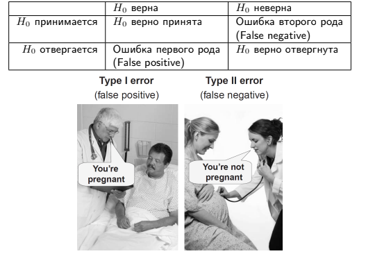

**Задача проверки гипотез несимметрична относительно пары** $(H_0, H_1)$: вероятность ошибки первого рода ограничивается сверху величиной $\alpha$, а второго рода — минимизируется путём выбора критерия.

Уровень значимости α** — это вероятность отвергнуть нулевую гипотезу, когда она верна (вероятность ошибки первого рода).
**
**Мощность критерия** — вероятность отвергнуть H0​, когда она неверна (верно принять H1).

Вероятность отвергнуть нулевую гипотезу зависит не только от того, насколько она отличается от истины, но и от размера выборки.  
По мере увеличения $n$ нулевая гипотеза может сначала приниматься, но потом выявятся более тонкие несоответствия выборки гипотезе $H_0$, и она будет отвергнута.

При любой проверке гипотез нужно оценивать **размер эффекта** — степень отличия нулевой гипотезы от истины, и оценивать его практическую значимость.

Для критерия Стьюдента размер эффекта часто измеряется с помощью $d$ Козна:

$$d = \frac{\bar{X}_1 - \bar{X}_2}{S}$$

где $S$ — объединённое стандартное отклонение.

**Интерпретация:**

- $d \approx 0.2$ — малый эффект,
- $d \approx 0.5$ — средний эффект,
- $d \approx 0.8$ — большой эффект.

Это основной показатель размера эффекта при сравнении двух групп. Он показывает, на сколько стандартных отклонений различаются средние значения групп.

**Примеры:**

**Пример 1: Медицина (Новое лекарство)**

- $H_0$: Новое лекарство не работает (эффект равен 0).

- **Ошибка 1-го рода:** Выпустить на рынок бесполезное лекарство.

- **Ошибка 2-го рода:** Забраковать работающее лекарство, которое могло бы спасать жизни.

- **Размер эффекта:** Если давление снизилось на 2 мм рт. ст. — это может быть статистически значимо на 10 000 человек, но размер эффекта ($d$) будет крошечным, и лекарство окажется бесполезным в клинике.

**Пример 2: IT (A/B тест дизайна кнопки)**

- $H_0$: Цвет кнопки не влияет на клики.

- **Мощность:** Если у нас мало трафика, мы можем не заметить, что новая кнопка лучше (ошибка 2-го рода). Нам нужно либо больше данных, либо очень большой размер эффекта.

---

## 11.F-критерий Фишера. Критерий согласия Пирсона хи-квадрат. Условия для проведения проверки. Примеры.

**F-критерий Фишера** используется для проверки гипотезы о равенстве дисперсий двух нормально распределённых выборок. Это параметрический критерий, основанный на отношении выборочных дисперсий.

**Выборки:**  

$$X_{1}^{n_1} = (X_{11}, \ldots, X_{1n_1}), \quad X_1 \sim N(\mu_1, \sigma_1^2)$$

$$X_{2}^{n_2} = (X_{21}, \ldots, X_{2n_2}), \quad X_2 \sim N(\mu_2, \sigma_2^2)$$

**Нулевая гипотеза:**  

$$H_0: \sigma_1 = \sigma_2$$

**Альтернатива:**  

$$H_1: \sigma_1 \neq \sigma_2 \quad (\text{или } <, >)$$

**Статистика:**  

$$F(X_{1}^{n_1}, X_{2}^{n_2}) = \frac{s_1^2}{s_2^2}$$

где $s_1^2,s_2^2$ — выборочные дисперсии.

**Нулевое распределение:**  

$$F \sim F(n_1 - 1, n_2 - 1)$$

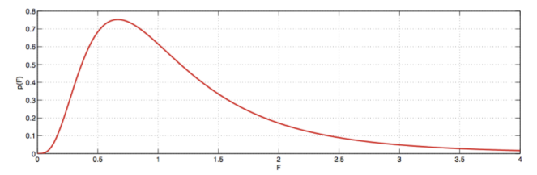

**Пример:**

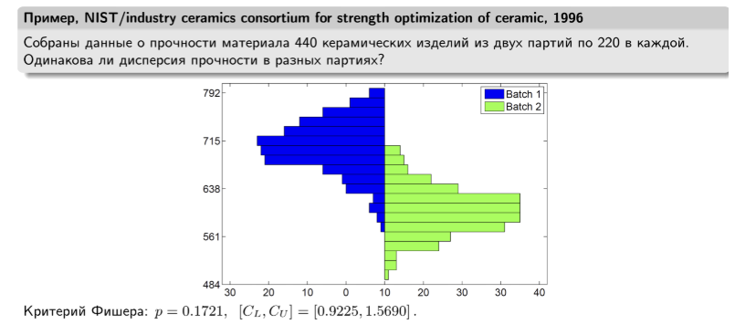

**Условия для проведения проверки F-критерием Фишера:**

- **Нормальность распределения:** Каждая из групп, между которыми проводится сравнение, должна иметь нормальное распределение данных. Это условие особенно важно, когда размеры выборок малы ($<30$).
- (не надо)**Гомогенность дисперсий:** Дисперсии внутри каждой из групп должны быть приблизительно равны. Это условие можно проверить с помощью тестов на равенство дисперсий, например, теста Левена или теста Бартлетта.
- **Независимость выборок:** Выборки в каждой из групп должны быть независимыми друг от друга.

**Критерий согласия Пирсона** используется для проверки гипотезы о том, что выборка происходит из некоторого теоретического распределения (например, нормального). Он основан на сравнении наблюдаемых частот в интервалах с ожидаемыми частотами, вычисленными из предполагаемого распределения.

**Выборка:** $X^n = (X_1, \ldots, X_n)$ 

**Нулевая гипотеза:** $H_0 : X \sim N(\mu, \sigma^2)$

**Альтернатива:** $H_1 : H_0$ неверна  

**Статистика:**

$$\chi^2 (X^n) = \sum_{i=1}^K \frac{(n_i - np_i)^2}{np_i}$$

$[a_i, a_{i+1}], \; i = 1, \ldots, K$ — интервалы гистограммы  

$n_i$ — число элементов выборки в $[a_i, a_{i+1}]$  

$p_i = F(a_{i+1}) - F(a_i)$ — вероятность попадания в $i$-й интервал при $H_0$

**Нулевое распределение:**  

$$
\begin{cases} 
\chi^2_{K-1}, & \mu, \sigma \text{ заданы}, \\
\chi^2_{K-3}, & \mu, \sigma \text{ оцениваются}.
\end{cases}
$$

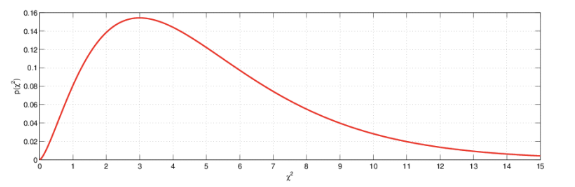

**Недостатки:**  
- разбиение на интервалы неоднозначно  
- требует больших выборок ($np_i > 5$ в 80% ячеек)

**Пример:** (в лекция нет)

**Ситуация:** Менеджер магазина утверждает, что покупатели заходят в магазин одинаково часто в любой день недели. Вы решили это проверить.

**Данные за неделю (наблюдаемые — $O$):**

- Пн: 40 чел.
- Вт: 45 чел.
- Ср: 55 чел.
- Чт: 50 чел.
- Пт: 60 чел.

**Всего:** 250 человек.

**Ожидаемые значения ($E$):** Если все дни равнозначны, то каждый день должно было прийти $250/5 = 50$ человек.

**Считаем $\chi^2$:**

1. Для каждого дня:  
   $$\frac{(O - E)^2}{E}$$
   - Пн: $(40 - 50)^2/50 = 100/50 = 2$
   - Вт: $(45 - 50)^2/50 = 25/50 = 0.5$
   - Ср: $(55 - 50)^2/50 = 25/50 = 0.5$
   - Чт: $(50 - 50)^2/50 = 0$
   - Пт: $(60 - 50)^2/50 = 100/50 = 2$

2. **Суммируем:**  
   $$\chi^2 = 2 + 0.5 + 0.5 + 0 + 2 = 5.0$$

**Вывод:** Сравниваем полученное число $5.0$ с критическим из таблицы $\chi^2$ (для $4$ степеней свободы). Если $5.0$ меньше табличного, мы принимаем гипотезу: менеджер прав, посещаемость распределена равномерно, а отклонения — просто случайность.

**Условия применения:**

- Выборка должна быть случайной и независимой.
- Все ожидаемые частоты $np_i$ должны быть не менее $5$ (рекомендация, см. стр. 28: «требует больших выборок ($np_i > 5$ в $80\%$ ячеек)»).
- Количество интервалов $K$ должно быть фиксированным и выбирается до анализа.
- Если параметры распределения (например, $\mu$ и $\sigma$ для нормального) оцениваются по выборке, то число степеней свободы уменьшается.

---

## 12.Особенности непараметрических критериев. Критерии знаков. Критерий знаков для связанных выборок. Описание критерия, пример.

**Непараметрические критерии** — это методы проверки гипотез, которые, в отличие от параметрических, не предполагают, что выборка взята из какого-то конкретного распределения (например, нормального), и не проверяют гипотезы о значениях его параметров.

**Ключевые особенности:**

- Применимость к нестандартным распределениям: Они используются, когда распределение признака «нестандартное», слишком скошенное или о нем ничего не известно.
- Работа с малыми выборками: В ситуациях, когда объем выборки недостаточно велик для применения центральной предельной теоремы (Z-критерия), непараметрические критерии становятся основным инструментом.
- Универсальность и нетребовательность: Например, критерии знаков практически ничего не требуют от данных и могут применяться даже к цензурированным выборкам (где часть значений известна лишь частично).
- Меньшая мощность: Эти критерии обладают невысокой мощностью по сравнению с параметрическими, так как часто «выбрасывают» часть информации (например, превращая значения в ранги или бинарный вектор).
- Разнообразие трактовок «среднего»: Под проверкой гипотез о средних разные критерии могут понимать разные величины: медиану (критерий знаков) или сдвиг функций распределения (критерий Манна-Уитни).

**Критерии знаков** — это одно из семейств непараметрических критериев. Эти критерии обладают невысокой мощностью, но они крайне универсальны и практически ничего не требуют от данных, поэтому они очень полезны на практике.

**Выборка:** $X^n = (X_1, \ldots, X_n)$, $X_i \neq m_0$ (В выборке не должно быть объектов, значение которых в точности равно $m_0$)

**Нулевая гипотеза:** $H_0: \text{med } X = m_0$

**Альтернатива:** $H_1: \text{med } X < \neq > m_0$

**Статистика:** $T(X^n) = \sum_{i=1}^n [X_i > m_0]$

**Нулевое распределение:** $T(X^n) \sim Bin\left(n, \frac{1}{2}\right)$

**Пример:**

Для примера можно рассмотреть данные о времени ремонта интернет-оборудования клиентов провайдера Verizon. Выборка состоит из 23 наблюдений, и, как видно по графикам на рисунке, распределение признака не похоже на нормальное. Хочется понять, позволяют ли собранные данные утверждать, что среднее время ремонта составляет больше восьми часов. Использовать для этого параметрические критерии (например, критерий Стьюдента) не стоит, поскольку у распределения признака тяжёлый правый хвост. Кроме того, объём выборки достаточно маленький, поэтому не получается воспользоваться центральной предельной теоремой.
Решить эту задачу можно с помощью **критерия знаков**.

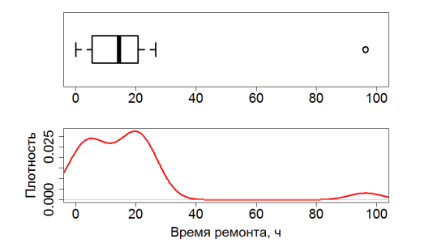

В задаче о времени ремонта интернет-оборудования проверяется нулевая гипотеза о том, что медиана времени ремонта составляет 8 часов:

$$H_0: \text{ med } X = 8.$$

Односторонняя альтернатива утверждает, что ремонт в среднем длится дольше 8 часов:

$$H_1: \text{ med } X > 8.$$

В имеющейся выборке ремонт занял больше 8 часов в 15 случаях из 23. Критерий знаков утверждает, что это недостаточно много. Его достигаемый уровень значимости (вероятность получить 15 из 23 в условиях справедливости нулевой гипотезы) $p = 0.105$. Нулевая гипотеза не отвергается, данные не позволяют утверждать, что ремонт в среднем длится дольше 8 часов.

**Критерий знаков для связанных выборок** - Этот вариант критерия используется для сравнения двух выборок, которые связаны между собой (например, измерения одного и того же параметра у одних и тех же объектов в разные моменты времени).

Вместо анализа самих значений анализируется только то, в какой из двух групп значение оказалось больше для каждой пары наблюдений.

**Выборки:**  
$X_1^n = (X_{11}, \ldots, X_{1n})$,  
$X_2^n = (X_{21}, \ldots, X_{2n})$,  
$X_{1i} \neq X_{2i}$, выборки связанные.

**Нулевая гипотеза:** $H_0 : P(X_1 > X_2) = \frac{1}{2}$.

**Альтернатива:** $H_1 : P(X_1 > X_2) \neq \frac{1}{2}$ (или $<$, $>$).

**Статистика:** $T(X_1^n, X_2^n) = \sum_{i=1}^n [X_{1i} > X_{2i}]$.

**Нулевое распределение:** $T(X_1^n, X_2^n) \sim Bin\left(n, \frac{1}{2}\right)$.

**Пример из лекции:** Рассматривается задача сравнения двух версий классификатора (алгоритма машинного обучения) на 14 наборах данных. Для каждого датасета посчитано качество (площадь под ROC-кривой) для базовой версии ($C4.5$) и модифицированной ($C4.5 + m$).

1. **Наблюдения:** Из 14 случаев в 10 модифицированная версия оказалась лучше, в 2 случаях — хуже, и в 2 — результат совпал (ничья).
2. **Гипотеза:** Проверяется $H_0$ о том, что качество одинаково, против альтернативы $H_1$, что модифицированный алгоритм лучше.
3. **Результат:** Достигаемый уровень значимости составил $p = 0.019$. Так как это меньше $0.05$, нулевая гипотеза отвергается, и делается вывод, что модифицированный алгоритм статистически значимо лучше.

---

## 13. Ранговые критерии: критерий рангов Уилкоксона, двувыборочные критерии для связанных выборк и независимых выборк (Манна-Уитни).

Для проверки гипотез о средних критерии знаков выбрасывают большую часть информации, содержащуюся в выборке. Вместо исходных значений признака используется бинарный вектор. **Ранговые критерии** позволяют сохранить больше информации.

Выборку  

$$X_1, \ldots, X_n$$

всегда можно превратить в **вариационный ряд**, то есть упорядочить её по неубыванию:

$$X_{(1)} \leq \cdots < X_{(k_1)} = \cdots = X_{(k_2)} < \cdots \leq X_{(n)}$$

Если при этом есть какие-то части вариационного ряда, в которых элементы полностью совпадают, эти части называются **«связками»**.

**Рангом** наблюдения $X_i$ называется его позиция в вариационном ряду. Если $X_i$ не попадает в связку, то  

$$\text{rank}(X_i) = r \quad \text{такой, что } X_i = X_{(r)},$$

а если $X_i$ оказывается в связке $X_{(k_1)}, \ldots, X_{(k_2)}$, то  

$$\text{rank}(X_i) = \frac{k_1 + k_2}{2},$$

то есть в связке все объекты получают одинаковый **средний ранг**.

Суть: Критерий проверяет гипотезу о положении медианы распределения. Он основывается на предположении, что распределение признака симметрично относительно медианы.

**Выборка:** $X^n = (X_1, \ldots, X_n)$, $X_i \neq m_0$, $F_X$ симметрично относительно медианы.

**Нулевая гипотеза:** $H_0 : \text{med } X = m_0$.

**Альтернатива:** $H_1 : \text{med } X \neq m_0$ (или $<$, $>$).

**Статистика:**  
$W(X^n) = \sum_{i=1}^n \text{rank}(|X_i - m_0|) \cdot \text{sign}(X_i - m_0)$.

**Нулевое распределение:** табличное.
При размере выборки >20 можно использовать нормальное распределение. $W \approx N\left(0, \frac{n(n+1)(2n+1)}{6}\right)$14.

При справедливости нулевой гипотезы каждый из рангов в выборке мог с одинаковой вероятностью оказаться с положительным знаком ($\text{sign}(X_i - m_0) = +$) или с отрицательным ($-$). Таким образом, получается $2^n$ вариантов распределения знаков по рангам. Перебирая все эти варианты, для каждого из них можно вычислить значение статистики.Так строится нулевое распределение критерия знаковых рангов.

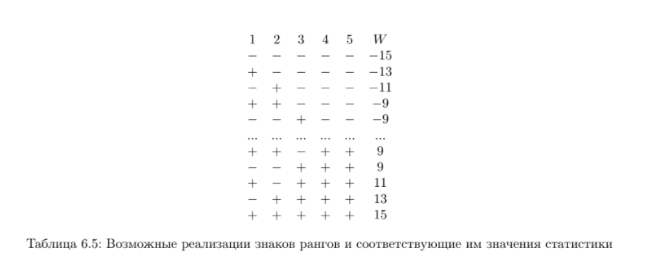

Когда у нас есть две связанные выборки (например, измерения одного и того же параметра «до» и «после» воздействия на одну и ту же группу объектов), используется **критерий знаковых рангов Уилкоксона для связанных выборок.**

**Выборки:**  
$X^n_1 = (X_{11}, \ldots, X_{1n})$,  
$X^n_2 = (X_{21}, \ldots, X_{2n})$,  
$X_{1i} \neq X_{2i}$, выборки связанные.

**Нулевая гипотеза:**  
$H_0 : \text{ med } (X_1 - X_2) = 0$.

**Альтернатива:**  
$H_1 : \text{ med } (X_1 - X_2) \neq 0$ (или $<$, $>$).

**Статистика:**  
$W(X^n_1, X^n_2) = \sum_{i=1}^n \text{rank}(|X_{1i} - X_{2i}|) \cdot \text{sign}(X_{1i} - X_{2i})$.

**Нулевое распределение:** табличное.

**Критерий Манна-Уитни** (иногда называемый критерием Уилкоксона-Манна-Уитни) предназначен для сравнения двух групп, объекты в которых никак не связаны между собой (например, контрольная и экспериментальная группы).

**Выборки:**  
$X_{1}^{n_1} = (X_{11}, \ldots, X_{1n_1})$,  
$X_{2}^{n_2} = (X_{21}, \ldots, X_{2n_2})$.

**Нулевая гипотеза:**  
$H_0 : F_{X_1}(x) = F_{X_2}(x)$.

**Альтернатива:**  
$H_1 : F_{X_1}(x) = F_{X_2}(x + \Delta)$, $\Delta \neq 0$ (или $<$, $>$).

**Статистика:**  
$X_{(1)} \leq \cdots \leq X_{(n_1+n_2)}$ — вариационный ряд объединённой выборки $X = X_1^{n_1} \cup X_2^{n_2}$,  
$R_1(X_1^{n_1}, X_2^{n_2}) = \sum_{i=1}^{n_1} \text{rank}(X_{1i})$.

**Нулевое распределение:** табличное.

Для критерия Манна‑Уитни также можно использовать нормальную аппроксимацию нулевого распределения, если в каждой из выборок есть по меньшей мере десять объектов:

$$R_1 \sim N\left(\frac{n_1(n_1+n_2+1)}{2}, \frac{n_1 n_2 (n_1+n_2+1)}{12}\right).$$

Относительно параметра $\Delta$ альтернатива в этом критерии может быть односторонней или двусторонней. Если справедлива альтернативная гипотеза и между распределениями действительно есть сдвиг, то средние значения признаков в выборках будут различаться. Поэтому это тоже в каком-то виде гипотеза о средних.

---

## 14.Перестановочные критерии: одновыборочный, двувыборочных для связанных и независимых выборок. Особенности перестановочных критериев. Различия перестановочного критерия и бутстрепа.

При использовании ранговых критериев выборки превращают в ранги, затем делается какое-то дополнительное предположение, и на основании этого предположения получается, что разные конфигурации этих рангов при справедливости нулевой гипотезы могут реализоваться с равной вероятностью. Далее необходимо перебрать все конфигурации, и на каждой посчитать значение статистики — таким образом оценивается её нулевое распределение.

Если в этом алгоритме пропустить первый пункт (не превращать наблюдения в ранги), а остальное делать точно так же, то получится алгоритм работы **перестановочных критериев**.

**Одновыборочный:**

**Выборка:** $X^n = (X_1, \ldots, X_n)$

$F_X$ симметрична относительно математического ожидания;

**Нулевая гипотеза:** $H_0 : \mathbb{E}X = m_0$;

**Альтернатива:** $H_1 : \mathbb{E}X \neq m_0$ (или $<$, $>$);

**Статистика:** $T(X^n) = \sum_{i=1}^n (X_i - m_0)$;

**Нулевое распределение:** порождается перебором $2^n$ знаков перед слагаемыми $X_i - m_0$.

Если нулевая гипотеза этого критерия справедлива, каждый из объектов выборки мог с одинаковой вероятностью реализоваться слева и справа от математического ожидания. Поэтому нужно перебрать все $2^n$ знаков, которые могут стоять в выражении для статистики перед разностью $x_i - m_0$. На основании этого перебора и будет восстановлено нулевое распределение статистики.

**Двухвыборочная задача со связанными выборками** решается с использованием абсолютно такого же критерия, как и для одной выборки: происходит переход к выборке соответствующих попарных разностей.

**Выборки:**  
$X_1^n = (X_{11}, \ldots, X_{1n})$,  
$X_2^n = (X_{21}, \ldots, X_{2n})$,  
выборки связанные.

**Нулевая гипотеза:**  
$H_0 : \mathbb{E}(X_1 - X_2) = 0$.

**Альтернатива:**  
$H_1 : \mathbb{E}(X_1 - X_2) \neq 0$ (или $<$, $>$).

**Статистика:**  
$D^n = (X_{11} - X_{21}, \ldots, X_{1n} - X_{2n})$,  
$T(X_1^n, X_2^n) = T(D^n) = \sum_{i=1}^{n} D_i$.

**Нулевое распределение:**  
порождается перебором $2^n$ знаков перед слагаемыми $D_i$.

**Перестановочный критерий для независимых выборок** работает абсолютно так же, как критерий Манна‑Уитни, за одним исключением — вместо рангов используются исходные наблюдения.

**Выборки:**  
$X_{1}^{n_1} = (X_{11}, \ldots, X_{1n_1})$,  
$X_{2}^{n_2} = (X_{21}, \ldots, X_{2n_2})$.

**Нулевая гипотеза:**  
$H_0 : F_{X_1}(x) = F_{X_2}(x)$.

**Альтернатива:**  
$H_1 : F_{X_1}(x) = F_{X_2}(x + \Delta)$, $\Delta \neq 0$ (или $<$, $>$).

**Статистика:**  
$T(X_{1}^{n_1}, X_{2}^{n_2}) = \frac{1}{n_1} \sum_{i=1}^{n_1} X_{1i} - \frac{1}{n_2} \sum_{i=1}^{n_2} X_{2i}$.

**Нулевое распределение:**  
порождается перебором $C_{n_1+n_2}^{n_1}$ размещений объединённой выборки.

**Особенности:**

Выбор статистики очень важен
  - Иногда разные статистики дают одинаковый p-value (∑Xᵢ и X̅ — эквивалентны)
  - Иногда дают существенно разные (X̅ и t-статистика Стьюдента — разные p-value!)

Требуются большие вычислительные ресурсы
  - Точное перечисление всех перестановок возможно только при очень маленьких объёмах выборок
  - На практике используют случайную подвыборку перестановок (обычно несколько тысяч)
  - Стандартная ошибка p-value ≈ √[p(1−p)/G'], где G' — число взятых перестановок

Нет хорошей асимптотической нормальной аппроксимации (в отличие от многих ранговых критериев)

**Различия перестановочного критерия и бутстрепа:**

(гемени момент, чисто для понимания) В перестановочном критерии мы создаем «мир идеальной нулевой гипотезы» (центр в 0) и смотрим, как в него вписываются наши данные. В бутстрепе мы берем «мир наших данных» (центр в $D_n$) и смотрим, насколько он совместим с теорией о нулевом эффекте.

**Перестановочный критерий** с помощью нулевого распределения статистики измеряет расстояние от $0$ до $D_n$ — значения параметра, реализовавшегося в эксперименте.  
**Бутстреп-критерий** измеряет, наоборот, расстояние от $D_n$ до $0$.

Перестановочный критерий является более точным, потому что в нём перебирается подмножество всех возможных перестановок данных, которые равновероятны при справедливости нулевой гипотезы. Бутстреп-критерий в описанном выше виде является только приближенным, поскольку в нём всегда перебирается только конечное подмножество всех возможных бутстреп-псевдовыборок, потому что их заведомо слишком много.

Самое важное различие между этими двумя критериями заключается в том, что они проверяют **разные гипотезы**, поскольку перестановочный критерий использует дополнительные предположения.

- **Перестановочный критерий** проверяет гипотезу **полного равенства распределений** в двух выборках:

$$H_0 : F_{X_1}(x) = F_{X_2}(x),$$

и проверяется она против альтернативы сдвига (в этом примере односторонней):

$$H_1 : F_{X_1}(x) = F_{X_2}(x + \Delta), \quad \Delta > 0.$$

Предполагается, что никак иначе, кроме как сдвигом, эти распределения отличаться не могут.

- **Бутстреп-критерий** проверяет всего лишь гипотезу о **равенстве математических ожиданий**:

$$H_0 : \mathbb{E} X_1 = \mathbb{E} X_2.$$

Гипотезу равенства он проверяет против односторонней альтернативы точно так же, как и перестановочный критерий:

$$H_1 : \mathbb{E} X_1 > \mathbb{E} X_2.$$

Однако эта гипотеза заведомо **более общая**: не используется предположение равенстве функций распределения в двух выборках.

---

## 15.Однофакторный дисперсионный анализ ANOVA. Межгрупповая и внутригрупповая дисперсия. F-критерий. Размер эффекта для ANOVA. Многофакторный ANOVA. Примеры.

Однофакторный ANOVA (однофакторный дисперсионный анализ) – это метод статистического анализа данных, который используется для определения наличия статистически значимых различий между двумя или более группами по одной независимой переменной.

Входными данными для однофакторного ANOVA являются значения зависимой переменной и групповой фактор, на основе которых проводится анализ. Фактор может быть любой номинальной или порядковой переменной, которая разделяет выборку на группы (в простом случае, это может быть пол, возраст, уровень образования и т.д.). Зависимая переменная – это та переменная, которую мы хотим сравнить в различных группах.

Однофакторный ANOVA проверяет нулевую гипотезу о том, что среднее значение зависимой переменной одинаково во всех группах. Если p-значение меньше заданного уровня значимости (обычно 0.05), тогда мы можем сделать вывод о том, что средние значения по группам различаются статистически значимо друг от друга. Кроме того, однофакторный ANOVA дает множество других статистических показателей, включая среднее значение, стандартное отклонение, диапазон, размах, медиану, аномальные значения и т.д.

Математическая модель: Представляется в виде $x_{ij} = \overline{X} + \alpha_j + \epsilon_{ij}$, где $\overline{X}$ — общее среднее, $\alpha_j$ — эффект фактора на $j$-м уровне, а $\epsilon_{ij}$ — случайная компонента (ошибка).
Предполагается, что случайная компонента $\epsilon_{ij}$ распределена по нормальному закону с нулевым средним и неизвестной дисперсией.

**Групповая дисперсия** – дисперсия значений признака $X$, принадлежащих группе, относительно группового среднего:

$$D_{k(\text{гр})} = \frac{1}{n_k} \sum_{i=1}^{n_k} (x_{ik} - \bar{x}_k)^2$$

(суммирование идёт по элементам $k$-й группы).

**Внутригрупповая дисперсия** – среднее арифметическое дисперсий, взвешенное по объёмам групп:

$$D_{(\text{внут})} = \frac{1}{n} \sum_{k=1}^{m} n_k \cdot D_{k(\text{гр})} = \frac{n_1 D_{1(\text{гр})} + n_2 D_{2(\text{гр})} + \cdots + n_m D_{m(\text{гр})}}{n}$$

**Межгрупповая дисперсия** – дисперсия групповых средних относительно общего среднего:

$$D_{(\text{меж})} = \frac{1}{n} \sum_{k=1}^{m} n_k \cdot (\bar{x}_k - \bar{x})^2$$

**Общая дисперсия** – дисперсия значений признака $X$, принадлежащих всей совокупности, относительно общего среднего:

$$D_{(\text{общ})} = \frac{1}{n} \sum_{i=1}^{n} (x_i - \bar{x})^2$$

F-критерий используется для проверки гипотезы о равенстве средних (отсутствии влияния фактора).

Нулевая гипотеза ($H_0$): Влияние фактора отсутствует, т.е. все групповые средние равны между собой ($\overline{X}_1 = \overline{X}_2 = ... = \overline{X}_p$).

Расчетное значение ($F^*$): Вычисляется как отношение межгрупповой дисперсии к внутригрупповой:

$$F^* = \frac{s_2^2}{s_1^2}$$

Принятие решения:

Если $F^* \le F_\alpha$ (критическое значение из таблицы), то влияние фактора несущественно.

Если $F^* > F_\alpha$, то нулевая гипотеза отвергается, и влияние фактора считается статистически значимым.

Размер эффекта отвечает на вопрос: какая доля общей вариации признака объясняется фактором?

Коэффициент детерминации ($\eta^2$):

$$\eta^2 = \frac{D_{(\text{меж})}}{D_{(\text{общ})}}$$

**Смысл $\eta^2$:** доля общей дисперсии, обусловленная фактором.

$\approx 0.01$ слабый эффект
$\approx 0.06$ средний эффект
$\geq 0.14$ сильный эффект

**Связь $\eta^2$ с F-критерием**

$$\eta^2 = \frac{(m - 1)F}{(m - 1)F + (n - m)}$$

**Омега-квадрат ($\omega^2$)** — поправка на смещение

$\eta^2$ переоценивает эффект в малых выборках.

Более точная оценка:

$$\omega^2 = \frac{D_{(\text{меж})} - \frac{m - 1}{n} D_{(\text{внут})}}{D_{(\text{общ})} + \frac{1}{n} D_{(\text{внут})}}$$

**Смысл:** оценка доли дисперсии в генеральной совокупности, объясняемой фактором.

**Многофакторный дисперсионный анализ (MANOVA)** используется для исследования влияния нескольких факторов на одну или более зависимых переменных. Он позволяет выявить, существуют ли значимые различия между группами, а также взаимодействия между факторами.

Модель: $x_{ijk} = \overline{X} + \alpha_i + \beta_j + \gamma_{ij} + \epsilon_{ijk}$, где $\gamma_{ij}$ — эффект взаимодействия факторов А и В.

Для каждого источника вычисляется свой F-критерий ($F_A^{\*], F_B^{\*}, F_{AB}^{\*}$) путем сравнения соответствующей дисперсии с остаточной $s_R^2$.

**Примеры:**

Пример 1 — разложение общей дисперсии на внутри- и межгрупповую (стр. 3–4)
Две группы, n=15, D(общ) = 148/45 ≈ 3,289
D(внутр) = 12/5 = 2,4
D(межгр) = 8/9 ≈ 0,889
Проверка: 2,4 + 0,889 = 3,289 ✓

Пример 2 — однофакторный ANOVA

4 методики обучения → F* ≈ 3,88 > 3,13 → методика значимо влияет

Пример 3 — двухфакторный ANOVA

Факторы: технология (3 уровня) + материал (2 уровня)

Результаты:

Фактор A (технология) → F* = 5,3 > 3,555 → значимо
Фактор B (материал) → F* = 1,1 < 4,414 → не значимо
Взаимодействие → F* = 0,28 < 3,555 → не значимо

Вывод документа:
Срок службы детали зависит от метода изготовления и не зависит от вида материала (в рамках исследованных уровней факторов).

---

## 16.Коэффициент корреляции Пирсона. Проверка гипотезы о коэффициенте корреляции Пирсона. Линейная простая регрессия. Ошибка предсказания, метод наименьших квадратов. Гипотеза о коэффициентах регрессии. Коэффициент детерминации.

**Коэффициент корреляции** характеризует силу связи между переменными. (ЭТО ПРОСТО ПАРАМЕТР ОПИСАТЕЛЬНОЙ СТАТИСТИКИ)

**Коэффициент корреляции Пирсона** характеризует существование линейной зависимости между двумя величинами.

$$r_{XY} = \frac{\sum_{i=1}^n (x_i - \bar{x})(y_i - \bar{y})}{\sqrt{\sum_{i=1}^n (x_i - \bar{x})^2 \sum_{i=1}^n (y_i - \bar{y})^2}}$$

**Свойства**:
- $-1 \leq r \leq 1$
- $r > 0$ — прямая связь, $r < 0$ — обратная
- $r = 0$ — отсутствие линейной связи
- не зависит от единиц измерения

Так как коэффициент $r$ рассчитывается по выборке, нужно проверить, не является ли полученная связь результатом случайности.

Нулевая гипотеза ($H_0$): $\rho = 0$ (в генеральной совокупности корреляции нет).

Альтернативная гипотеза ($H_1$): $\rho \neq 0$ (связь статистически значима).

Статистика критерия: Используется $t$-критерий Стьюдента:

$$t = \frac{r \sqrt{n-2}}{\sqrt{1-r^2}}$$

где $n$ — объем выборки, а число степеней свободы $df = n - 2$.

Сравнивается с критическим значением t-распределения.

**Требования к выборке для тестирования гипотезы о коэффициенте корреляции Пирсона:**

1. Для каждого $X$ значения $Y$ должны быть распределены нормально, и для каждого $Y$ все $X$ должны иметь нормальное распределение –  
   - [x] **двумерное нормальное распределение** (bivariate normal distribution).

2. Должно соблюдаться требование гомогенности дисперсии $X$ для каждого $Y$ и наоборот.

Линейная простая регрессия - Это модель, которая описывает зависимость одной переменной ($Y$) от другой ($X$) в виде прямой линии.

Уравнение: $\hat{y} = \beta_0 + \beta_1 x$, где: $\hat{y}$ — предсказанное значение; $\beta_0$ — свободный член (интерцепт), точка пересечения с осью $Y$ ; $\beta_1$ — коэффициент регрессии (уклон), показывающий, на сколько изменится $Y$ при изменении $X$ на единицу.

Для любого наблюдения реальное значение $y_i$ отличается от предсказанного $\hat{y}_i$ на величину остатка (ошибки): $e_i = y_i - \hat{y}_i$.

Метод наименьших квадратов (МНК) — это способ нахождения коэффициентов $\beta_0$ и $\beta_1$, при котором сумма квадратов остатков будет минимальной:

$$\sum (y_i - \hat{y}_i)^2 \rightarrow \min$$

Гипотеза о коэффициентах регрессии

Обычно проверяется значимость коэффициента наклона $\beta_1$.

Нулевая гипотеза ($H_0$): $\beta_1 = 0$ (независимая переменная $X$ не влияет на $Y$).

Проверка: Аналогично корреляции, используется $t$-статистика: $t = \frac{\hat{\beta}_1}{SE(\hat{\beta}_1)}$, где $SE$ — стандартная ошибка коэффициента. Если $p$-value $< \alpha$, то переменная $X$ признается значимым предиктором.

**Коэффициент детерминации**

$$R^2 = \frac{SS_{\text{regression}}}{SS_{\text{total}}} = \frac{\sum_i (\hat{Y_i} - \overline{Y})^2}{\sum_i (Y_i - \overline{Y})^2}$$

Показывает, какую долю изменчивости (буквально, её даже можно выразить в процентах) зависимой переменной ($Y$) объясняет независимая переменная (регрессионная модель).

$r$ – коэффициент корреляции, $r^2 = R^2$

**Насколько велик или мал коэффициент корреляции 0.3?**  
$0.3^2 = 0.09$, независимая переменная объясняет только около $1/10$ изменчивости зависимой переменной.

---

## 17.Множественная линейная регрессия. Теорема Гаусса — Маркова. Коэффициент детерминации. Анализ остатков регрессии.
